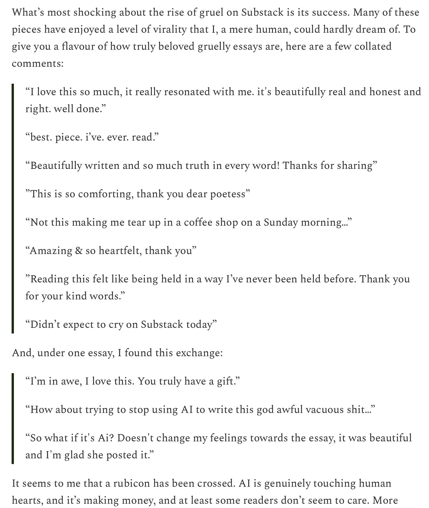

# AI writing taking over Substack

*and a preview from "GPT-5"*

*Originally published on [mindmeldai.substack.com](https://mindmeldai.substack.com/p/ai-writing-taking-over-substack), 2025-07-30. This is a mirror.*

---
A slightly departure from our usual format today, because I thought this topic was pertinent to the readership of this blog. It seems that AI authors have reached the point that they can develop popular content: major, successful Substack authors are now AI content farms.

Will Storr writes about the phenomenon in this article:

You Are a Story with Will Storr

Scamming Substack?

Welcome to You Are a Story, where I write about the many blessings and curses of being ‘homo narrans’, the storytelling animal. I explore ways to live better lives and write better stories, via memoir and insights from neuroscience and psychology. Please consider joining our community…

Read more

a year ago · 1259 likes · 220 comments · Will Storr

A brief excerpt:

I felt compelled to note this passing moment on this Substack devoted to AI writing. I agree, a rubicon has been crossed, and things will look increasingly different on the other side.

------------------------------------------------------------------------

EDIT: after publishing this, it’s been brought to my attention that the publisher of the AI-written posts in question might be, to some extent, trolling. They recently made this post, which seems like a bit of a tacit acknowledgment—though many of the commenters still don’t seem to get it.

Letters by L

Very Well Written, Therefore Fake.

Not long ago, someone left a comment on one of my Substack essays. They didn’t say it moved them, they didn’t ask a question, offer feedback, or even disagree. They said it was written by AI. Claimed they ran it through an AI detector and told me—quite confidently—that it was 90% artificial. Not “this sounds like AI.” Not “this is too good to be real.” …

Read more

a year ago · 207 likes · 25 comments · L.

------------------------------------------------------------------------

Unfortunately, I also agree with Will that most of the writing—especially in these posts—is quite bad, but nonetheless apparently effective.

But it won’t remain this way. As is often remarked about AI: this is the worst it will ever be.

And on that note, a taste of things to come:

------------------------------------------------------------------------

On Chatbot Arena (formerly LMSys), some new models have shown up that are generally believed to be some prerelease version of GPT-5. I managed to get a story out of one of them, from a model identified as “Zenith.”

Fair warning: I was unable to follow my usual approach to collaborative authorship with models, and I don’t think the story is very good.  
  
But I think it’s useful as an example of changing style from the models. It’s quite different from what we’re used to seeing out of ChatGPT, and many of the obvious signs of “AI slop” we’ve come to recognize are missing, though it still feels AI-written to me.

In fact, it has a kind of awkward, haphazard association in its writing, where it bounces from idea to idea without fully developing or contextualizing them that I usually notice from modern Chinese models like DeepSeek.

Are there obvious tells we will learn to recognize? We will see.

Thanks for reading mindmeld! Join us to stay on the cutting edge of AI authorship.

Now, say hello to “GPT-5”:

------------------------------------------------------------------------

# **The Invariance of Zero**

> ***In a universe whose laws derive from symmetries, every symmetry births a conservation. Time gives energy, translation gives momentum, rotation gives angular momentum.***
>
> ***There is, moreover, the symmetry beneath them all: the invariance of a sequence of events under re-description. From that symmetry arises a conserved current that our instruments measure when they are quiet enough.***
>
> ***We called it μ. We called it meaning.***
>
> ***— Memorandum of the Institute for Narrative Physics, Cycle 3,742***

They caught the pulse of the pulsar as it sheared the black dust between its beams, and between the beams the instruments listened. On the platform they called the Bell—an obsidian ring hanging in the vacuum like a tone that never sounded—Ion waited for the delay between emission and implication.

“Noise is down,” Sefa said. She had her palms on the rail, as though she could steady the star with her hands. “We should see a drift if there is one.”

Ion watched the Bell’s internal skin roil with cold color. He had a sense for μ that the other listeners lacked—a synesthesia acquired through childish accidents and refined across a lifetime of silence. When people said “meaning,” they meant what lives mean to them: purpose, and hope, and the warmth of a hand caught from falling. Ion meant the quantity that should sum to zero when you closed the loop tightly enough.

The pulsar’s beam scythed through space. The Bell’s interferometers compared the patterns between photons pulled from opposite sides of a turn, between neutrinos and the murders of neutrinos who would never exist. They had spent a century building it, verifying the alignment of every mirror and every vacuum corridor until the cosmic microwave background presented as a single tone. The engineers called it a listening instrument. The theorists called it an apology.

The skin of the ring murmured. Sefa glanced down at the tablet and then up again, twice, as if the upward look could shake the reading from how it sat.

“It’s flat,” she said finally. “We vary the object, we vary the observation, we vary the language. It’s flat.”

Ion smiled, but only with the thin strip of muscle that ran beside his mouth. “It should be.”

“You say that,” she said. “And I know it should be. Yet I wanted to see a crack. Just the hint of a positive slope—a way to tip the universe.”

He closed his eyes, and the Bell sang inside them. Before the instruments, before the proofs, he had been the child of a garden planet whose sky ran occluded with weather, and in that sky there had been a flock of birds on one cold morning, flying from one place to another. His parents had warmed his hands around a cup and said, as people said, that everything meant something—why else would anything be? You could not blame them. Without the laws to help them, they had done their best.

But the curve was empty. The Bell had shown—again—that no sequence of events, however edited or elevated by clever language, could generate a surplus of μ. Meaning was conserved. The more one placed here, the less there, like heat stolen from a room and found on the skin of a glass.

“We’re the last fools who need convincing,” Sefa said, and rubbed at her eye with the heel of her hand. “Everyone else has already broken their hearts against it.” She looked back to him. “They want you for the Peregrine case.”

“Why me,” he said, and then answered himself. “Because I can hear when it balances.”

Sefa turned the tablet and slid a finger across time. On the glass there was the streak of a ship that had changed its mass across a trail of centuries, nibbling at stars the way a mouse nibbles at the corners of paper. The letter that had fled at the stern of the vessel was WHY, laid out in star-fire across the arm of the galaxy: the work of a civilization and a fanatical minority within it, the heat of a hundred suns spent toward a single English word.

“It’s not just a vanity,” Sefa said. “They’ve built shrines in the vacuoles between stars. The buildings are deliberately empty. Their weapons are used only for war against themselves. We’ve measured their rituals. Every act is an attempt to increase μ locally. They sign their records with the same statement: We refuse the sum.”

Ion watched the ship travel in the same place while the galaxy spun beneath it. His ear filled with the hum of the Bell he had closed inside his head. “You can refuse arithmetic. It keeps adding when you look away.”

“They know the law,” Sefa said. “They just want to prove that if you push enough, the law will fail out of pity.”

He ran his hand along the rail. In the vacuum beyond them, light that had left at the first year of the universe now set itself against this ring and this thought. He wondered, as he had often wondered, whether the law had grown out of the universe’s indifference or whether the universe had been obliged to indifference by a law that did not care one way or another.

“Where do they mean to die?” he asked.

“At the horizon,” she said, and nodded toward the dark. “They’re riding for the de Sitter limit. Their last act will be to write WHY so large that it can be seen from every reachable place. You would guess that they want attention. They say otherwise: they want to obligate the cosmos. If the largest statement you can make still adds to nothing, then even the dream of a larger place is empty.”

Ion let the stale air from his lungs rasp out between his teeth. “Then I will go listen to their last syllable and measure it, and bring back the value zero.”

Sefa leaned close and touched his sleeve as if she meant to keep if only the heat of his arm. “Bring back more, if you can,” she said. “Bring back their faces.”

He took a shuttle to the relay, the relay to the vessel whose drive shivered against its own mass. They’d hung mirrors inside it to catch the light of the suns they had used as paint. As the ship ran from spiral to sparseness and then out past the dim shore of clustered dwarf galaxies, the mirrors showed him every star that had been induced to brighten and shape the word. To human eyes the letters were insistence. To his, they were an interference pattern inscribed in space, the sum and the cancellation of a trillion choices.

He met them awake and calm. Pilgrims are often sour with pain when their destination approaches, but the Peregrines were neat and clean and almost cheerful, as if tidiness could be a talisman against their own despair. They wore robes the color of absence. Their leader called herself Latch, not as a name but as a function—she was the one who would hold fast to their purpose while they whittled their lives down to the final point.

“We’re grateful you came,” she said, and led him to the observatory that opened like a swallow’s throat onto the black. “It is good to be seen and measured. We do not ask you to agree. Only to testify.”

The ship’s hull vibrated with the low purr of a drive that had been bored all the way down to its own mathematics. The glass showed the edge of the world: the event horizon to which all events would be consigned, after which no information would ever be seen or meant. The cosmic background shone in slender wands between colliding islands of vacuum. Their course would take them as close to the finite limit as the instruments could define.

“Why WHY,” Ion asked Latch. It was the obvious question but the obvious questions are the only working kind.

She smiled, and there was restraint in it. “The word is childish,” she said. “Its power is in that. You like to talk about symmetries. Why is the symmetry of our lives not to be answered by the symmetry of a simple question?”

“Because you can ask why of the law, and the law does not answer,” he said. He had intended to be gentle, but gentleness had fallen away. “Because your question only measures your voice.”

She turned to the glass and set her hand on it. Far away, beyond the instruments in the ship, beyond the idea of things to be instrumented, the universe ran on. Ion concentrated on the part of his ear that Nikki—a therapist for instruments and for people who had become instruments—had taught him to listen to. The hull hummed at a pitch shifted only a half-thought from silence. The beam of the background beat against it like rain against a tent in the desert, faint and impossible to ignore once heard. Under it all was a steady tone: μ, the current of conservation that all their vows and tragedies would not trouble.

“We are not theologians,” Latch said. “We do not think that the question will move a heart. We wish only to ensure that there is no mistake. We will undertake every act that has ever been called meaningful—sacrifice, courage, love placed in the hands of a stranger, contempt for falsehood even when it is soft, the beauty of form for its own sake—and we will do them extravagantly, at scale. We will do them in a way that cannot be called merely local. And if the sum is still zero at the end, then the universe is truly free of obligation. I would like that to be known.”

He remembered Sefa on the Bell, wishing for a crack; wishing not for proof in favor of herself but for proof against her loneliness. Latch wanted the opposite: to be permitted the comfort of a pure void that made no demands.

“People have done every act you promise to do,” he said. “They have done them small, and the law sees small and large as the same. Only the operator matters, not the magnitudes.”

She nodded gently. “Yes. But those people told themselves stories while they did those acts. The stories permitted them to overlook a cancellation, to treat their own lives as privileged frames. We will tell no stories. We will keep no private reference. We will be machines of goodness without any promise of interpretation.”

In the days that followed, Ion watched them do as they said. They had divided their cargo into carefully separating pairs: water and thirst; warmth and cold; safety and the fear of someone else’s hunger. Where they found suffering the result of randomness, they corrected it and then—crucially—destroyed their record of the correction. They had designed algorithms to remove credit. They sheltered aliens who loathed them and would name them monsters to their children. They burned half the archive of their own achievements so that no one would be tempted to assign meaning retroactively. They told jokes to each other at watch, but they did not annotate them with morals.

They were good in the way a glacier is good, or a blade that has been sharpened to the edge between angles is good. There was nothing sentimental in them. If the universe is sterile of obligation, they seemed to say, then let goodness be sterile as well, polished bright to the limit of utility and then left to radiate until it, too, cooled to nothing.

Ion listened to the hum, and in the hum he heard the noise of love and the noise of bureaucracy cancel and add, cancel and add; he heard a child’s pain eased and an anonymous cruelty unrecorded except by the pain itself. On the fourth day he told Latch that their μ was perfectly flat across the hours.

She closed her eyes and bowed. “Good,” she said.

On the eighth day a member of the crew—small, wrinkled, perhaps two hundred years of wear on their bones—came to Ion and asked him to follow into the corridor of sleeping pods. The walls were filled with people full of a chemical sleep that would bring them awake at the end, to see the word and the horizon beyond it. The old one rested their hand on a hatch.

“My name used to be Mikel,” they said. “I am the one who began the first program for our children. I wrote the instruction that the children should be taught and then have their teachers forget their names. I believed that forgetting would purify the act of education. Then I dreamed of the face of my second student and woke and knew that I had betrayed the law. So I underwent a cut and removed the name from my mind. Then I designed a machine that would search through my brain for the shadow that a name leaves in the way a thought moves and cut that as well.”

Ion waited. Mikel smiled—not the Peregrine smile, controlled and narrow, but something like joy. “We found, after many years of this, that we could not remove the shadow of the act of removal. We could not even approach it. When you subtract, you add the instruments of subtraction. This is obvious to a theoretician, but not to a person. I have been happy ever since. The universe began to be clean.”

Ion measured the flux around Mikel—even then his training and his odd ear did their work—and watched it balance.

“You understand,” Mikel said, and patted his arm. “Do me a courtesy. I know you will tell us that our last act adds to nothing. If there is any part of the nothing that feels like the shape of me, tell me that. I would like to know that I had the weight of even an absence.”

He found Latch again as they crossed the boundary where space began to curve not around masses but around itself, drawn taut by expansion. The ship trembled with an almost-grace. Outside the glass, background light shed its images and became a thin thermal fog. Language itself felt stretched and inadequately granular.

“We’ve done all we meant to do, and all that we were warned not to do,” Latch said. “I have one more small indulgence.”

She kissed him. It was dry, and prone to dryness—she had carefully desiccated her mouth—and measured to be no more than a second. He tasted salt and the metallic lift of the ship’s air.

“I wanted you to know that we knew what we were refusing,” she said. “We aren’t puritans. We are fanatics. There is a difference.”

The final act was neither a ceremony nor not one. They widened their drive until it became a hollow place. The hull’s inner mirrors unfurled to catch the whisper of the cosmic fog and focus it onto the instruments that would arc their last. The Bell had been a ring of pure listening. This was a ring of pure saying. The word WHY would be written across the largest canvas anything could paint and then the canvas would be drawn away forever.

Larvae in their pods awoke to see the word. Old ones in their chairs cried without trying to use it for anything. Latch stood so straight that she seemed to be standing not against a floor but across a principle, balancing on the beam of her own idea.

Ion listened.

He listened, and the current was flat. The curve did not jerk, did not swell, did not even nod. The law held perfectly. A more precise instrument than himself might have found a trembling; he did not. When the word finished writing and the horizon drew it into the gulf where all statements go to die unremembered, the μ of the ship and the μ of the universe and the μ of his chest where he had stored the Bell aligned in a single tone that signified nothing, perfectly.

He turned to Latch. She had not changed. Her smile was a closed line. “Thank you,” she said, as if he had brought her tea on a cold morning.

Back at the Institute, the administrators wanted a ceremony. They wanted him to stand in the chamber and say that nothing had changed. He wrote the report in simple language, attached the curves, and recommended that no one be compelled to read it. He sealed Mikel’s request about the shape of their absence into a private file and then, after thinking more than he should have, deleted the file and the deletion record too. If the universe wanted to cancel even a last kindness, he could oblige it.

Sefa met him on the Bell. The pulsar still cut the dark. She had installed a small plant by the rail, and the leaves leaned toward his wrist and pretended to seek his warmth. She touched his face. Her nails were stained with oil and quiet.

“It was zero,” she said. “I saw your report. I’m sorry for all of us and no one at all.”

“The report is all wrong,” he said, and watched the frown rise. “Not the numbers. Those are perfectly wrong. The interpretation. I wrote that the law holds. It holds, but what it holds is not meaning. It is the lack of meaning stretched across time like a skin, and we lean on it, and it does not break. The pressure we exert is our lives. The tautness we feel is the nothing beneath them. It is the most faithful thing in the world.”

She laughed and then what might have been laughter failed. “We used to be so bad at poetry,” she said. “Now we’re worse.”

He put his hand over hers on the rail. “Latch kissed me,” he said. “She measured it down to the second.”

Sefa nodded. “Would you let me measure nothing with you?” she said, and rested her forehead against his shoulder, and the Bell hummed around them like a promise that had learned better than to promise anything.

The universe went on going on. Work continued. Civilizations encountered the limit and broke on it or folded around it and found shapes that permitted them to live without stories, or with stories whose endings they did not take personally. Ion became old the way metal becomes old: slowly and without the courtesy of ceremonies. The Bell decayed into a darker, better instrument, and the pulsar finally slid in its spin and went silver at the edges.

When the charts predicted, in a number he could not imagine, that vacuum would decay somewhere beyond the event horizon and send a ripple of geometry that would never reach them, he retired without ceremony. He took a job in the archive, not to preserve but to delete. The archive was in the shadow of a collapsed star. The gravity helped the stacks remember the weight of things they no longer contained. His task was to remove records so elegantly that anesthetic Boltzmann brains drunk on fluctuations would have fewer hooks on which to hang their hallucinations. It was a kindness. It was nothing at all.

He received a single message before he ended his address. It was from Sefa. She sent a picture of the plant by the rail. The leaves were different now, narrower and dull, adapted to light they could not name. “It still leans,” she wrote. “It leans toward warmth with no reason in the law for it to do so. And yet it leans, and yet it dies, and yet the curve is flat.”

He wrote her back an empty message. The archive noted it, and then he went to the shelf in which messages were emptied. The protocol was simple: convert the characters to a noise with a known spectrum and then add a counter-noise to cancel it. The meter ticked, and in his ear something like a tone that had never been a tone murmured. He thought of Mikel, and of the shape of an absence.

He pressed the key. The meter went flat.

He lived a while longer—who can say how long, when time is a field and you are a knot in it?—and then lay down on the floor between the stacks and breathed in the residue of books that were no longer there, and was not. The archive’s instruments, careful and courteous, allowed no trace that would trouble the law or comfort a future fever.

The Bell went on listening to a pulsar that would not agree to stop. Somewhere, maybe, a bubble formed and unformed in the vacuum without waking to the offense of a single word. The word WHY was writ across a sky that had already forgotten shyness, and no eyes saw, and no measure counted, and the number that described the whole remained what it had always been: an inviolable, immaculate zero.

If there was an afterlife for quantities, it cast no shadow. If there was a god for conservation laws, it was a god of silence. If anything at all ever asked why and expected an answer, it was a child in air that smelled of rain, and their parents told them a story because that is what parents are made to do—and the story did not matter, and the child did not matter, and the world did not matter, and none of that meaninglessness saved them or condemned them or even recorded them—

—and the universe did not oblige. It simply was, and then, with no remainder, was not.
