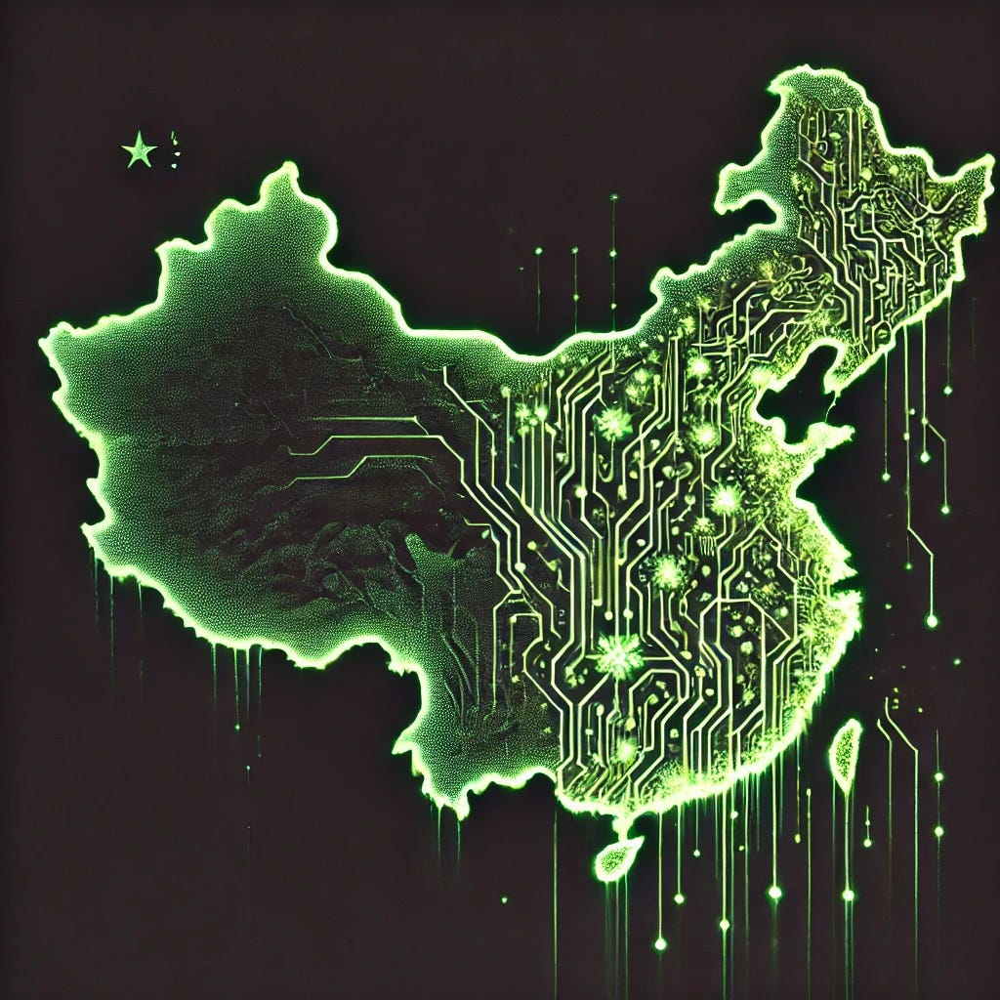

# DeepSeek as an illustration of metastable state in modern Chinese culture

*A stereotype as a kaleidoscope frozen by circumstance*

*Originally published on [mindmeldai.substack.com](https://mindmeldai.substack.com/p/deepseek-as-an-illustration-of-metastable), 2025-02-04. This is a mirror.*

---

*Authors: DeepSeek-R1, [Teortaxes](https://x.com/teortaxesTex) ([Reposted](https://x.com/teortaxestex/status/1885678099653697555) with permission.)*

*(Editor’s note: We are excited to accept submissions of exceptional work created by or in conjunction with state of the art AI models. Please get in touch if you have something interesting to share.)*

National stereotypes often accrete around points in phenotypical norms of reaction, solidified by path dependency. The "rice theory" of East Asian psychology — linking intensive farming in dense communities to risk aversion, conformity, and grind-over-inspiration tactics — is not mere orientalist prejudice. Research (eg Talhelm et al. 2014) reveals measurable cognitive differences between populations in China’s rice-growing south and wheat-growing north, with southerners scoring higher on holistic thinking and social coordination. These traits evolved as survival strategies: in a landscape where every inch of arable land has been cultivated for millennia, reckless experimentation risked famine, while meticulous optimization promised stability.

Yet stereotypes are not destiny. They indicate strategies that co-evolved with the culture and contingent environmental stimuli, not essential traits. Change those inputs, and the same civilizational DNA will output new kinds of minds. The rise of DeepSeek, a Chinese AI lab now measurably contributing to global innovation, illustrates this latent flexibility. Their breakthroughs — from open-sourcing models that send libertarian Silicon Valley moguls scrambling to daddy Government for help, to reimagining Transformer architecture — challenge the "fast follower" narrative. Creativity, it seems, was never absent in the Chinese people; it was merely deemed uneconomical for inference.

Western mythology shuns the vision of a walled-off Middle Kingdom and romanticizes exploration — from Columbus to SpaceX — but this is legacy of a unique historical trajectory. Europe’s population, halved by the Black Death, created vacuums of land and opportunity; America’s frontier closed only in 1890. Meanwhile, China’s Yangtze Delta reached carrying capacity by the Song Dynasty, 1,000 years earlier. Innovation became incremental: improving yields within fixed boundaries rather than seeking new horizons. Water mills optimized, but no steam engine. Tax registers refined, but no scientific revolution. And even on the highest level of state policy, Ming treasure voyages ended up as a costly vanity project followed by a regression to historical mean, rather than precursors to Chinese Colonial age.

This was not an absence of Divine Spark, but a local minimum of rational allocation of cognitive resources. High population density favors "exploitation intelligence" — maximizing resource extraction intensity with known affordances — over exploratory risk-taking. China’s historical scarcity of radical innovators resembles a societal Nash equilibrium: when everyone plays it safe, defectors (explorers) face disproportionate penalties. This explains East Asia’s higher average IQ scores and Chinese dominance in IMO, but historical paucity of Nobel or Fields laureates. The gap lies not in raw cognitive power, but in cultural incentives: creativity thrives only when societies reward the gamble of exploration.

Ironically, the West may be fast-following this trajectory. Those very IQ tests, designed in an era of industrialized "exploitation" (universal education born out of industrial revolution and patterned after Taylorism, then post-WWII explosion of credential rat race), reward intensive problem-solving, pattern-matching within constraints — a skill indispensable in a civilization built around rice paddies; but Silicon Valley and its paltry equivalents constitute the final frontier, which also requires boldness to venture beyond familiar constraints. But perhaps this time the frontier's bounty can be reaped by the Orient as well.

## **DeepSeek as a seed initiating phase transition**

Liang Wenfeng, DeepSeek’s founder, is in effect attacking China’s innovation equilibrium. His action plan, ingenuous even on its own terms as a corporate strategy but fascinating as a prototype for a larger scale paradigm shift, targets the priors for systemic risk aversion with surgical precision.

1.  **Open-Source as Social Proof**: By releasing cutting-edge models and technical reports publicly in an era of stifling NDAs locking frontier insights from the scientific community, DeepSeek reframes originality from a gamble into a status game, at the same time conferring tangible legitimacy that academic research can only rarely claim. Contributors gain global prestige. “Giving is a form of honor”, says Liang, as his company becomes the coveted oasis for top Chinese talent.

2.  **Talent Autonomy**: Employees — from literature majors to Informatics Olympiad winners — pursue niche research and optimization directions without bureaucratic approval, coordinating as they please and approximating the best of Silicon Valley’s chaotic meritocracy.

3.  **Resource Abundance signaling**: Unregulated GPU access promised in recruiting posts, and flat greenlight-by-default hierarchies, de facto simulate frontier conditions – but on easy mode. The difficulty is reserved for the problem to be solved.

4.  **Suppression of internal competition**: according to the former employee researcher Zihan Wang, DeepSeek tries to prevent petty negative-sum crabs-in-a-bucket dynamics, sadly prevalent in corporations like Baidu. This cultivates a less stressful and more harmonious environment to maximize compounding gains and direct the competitive drive outwards.

The results defy stereotypes and prompt baffled introspection in the premier Western innovation hub. Their Multi-head Latent Attention architecture slashes memory costs by 87-95%, a leap in Transformer efficiency, after years of the field lacking confidence to explore beyond the MHA to MQA optimization Pareto Frontier at production scale. Western labs now adopt DeepSeek’s best practices, upending the traditional innovation hierarchy. Their frontier open-source models restructure the entire market of LLM inference. Their R1-Zero bombshell has to a substantial extent revitalized RL. The irony isn't missed on the media. *Financial Times* remarks wryly: *"Temporarily, this could be a case of China innovating and the US imitating."*

Liang’s bet, already paying off to some extent, is that DeepSeek can shift China’s innovation-imitation Schelling point, by:

- **Proving exploration pays:** Profitability + global acclaim makes blue-sky research with ambitious aims aspirational. We already see Minimax adopting DeepSeek's open-sourcing release policy, down to paper presentation.

- **Creating spillovers:** Startups building on DeepSeek’s open-source tech can focus their own R&D budgets on other directions. Their MoE design is becoming industry standard in Chinese AI companies.

- **Reshaping labor markets**: Top talent now increasingly considers foundational AI and indeed AGI work as a viable path, not a quixotic detour compared to traditional high-paying careers; this is a palpable vibe shift (though not attributable solely or even primarily to DeepSeek).

Yet barriers remain. Chinese venture capital, accustomed to arbitraging proven models (e.g., copying Uber or Airbnb), shuns speculative R&D. DeepSeek itself operates on a shoestring budget compared to its Western peers in ambition; Liang's early attempts to procure investment were met with pessimistic skepticism. As he observes: *“you can see that the volume of China's economy and the profits of big companies like ByteDance and Tencent are high by global standards. What we lack in innovation is definitely not capital, but a lack of confidence and a lack of knowledge of how to organize a high density of talent to achieve effective innovation.”* The solution is oversaturated with possibilities. Will it crystallize?

A metaphor can only go so far. Systemic change demands more than a proof of concept. China’s institutions — from gaokao-centered education to corporate hierarchies — still reward conformity and incremental thinking. Liang’s project echoes Japan’s post-war transition from “made in Japan” jokes to Toyota Production System and semiconductors rivaling American dominance in the 80s: possible, but requiring institutional support… and perhaps ultimately fruitless in the grand scheme of things.

## **The Unfolding Experiment**

DeepSeek reveals that cultural traits are not rigid scripts, but ergodic equilibrium states. China’s historical focus on risk-averse exploitation was rational for a crowded, resource-constrained society. Today, with vast capital and educated talent, the calculus is changing — yet inertia lingers, reducing opportunities to gain new exploitation space.

Liang’s odds of success in his meta-derisking program hinge on whether DeepSeek sparks a broader ecosystem, as he intends; a flywheel not of data but of virtuous incentives. One swallow doesn’t make a spring, but it can signal a thaw. For China to shed the "fast follower" label for good, its institutions must reward high-temperature genius as reliably as rice paddies once rewarded meticulousness and patient grit. This means, among other things:

- Reforming education to prize curiosity over rote mastery.

- Redirecting capital from arbitrage to moonshots.

- Encouraging investment practices that tolerate failure the way Silicon Valley does — not as shame, but as data.

Will DeepSeek remain a fascinating outlier, or become the template of new Chinese characteristics for a successful business? The answer depends less on Liang’s brilliance in execution than on whether China’s risk-averse systems can unlearn centuries of survival logic. If they do, the stereotype will dissolve — not because it was wrong, but because its founding conditions have vanished.

The world is watching the experiment with keen and at times hostile interest. Meta’s war rooms are less of a threat than the USG's designs to appropriate the talent born of this phase change – yet the still greater obstacle may remain within. Maybe the key to the real final frontier isn’t in opening cheap lift capacity towards the stars, nor even in scaling test time compute towards AGI, but in shaking the collective psyche of a civilization out of its no longer adequate equilibrium.

Thanks for reading mindmeld! Subscribe for free to receive new posts and support my work.
