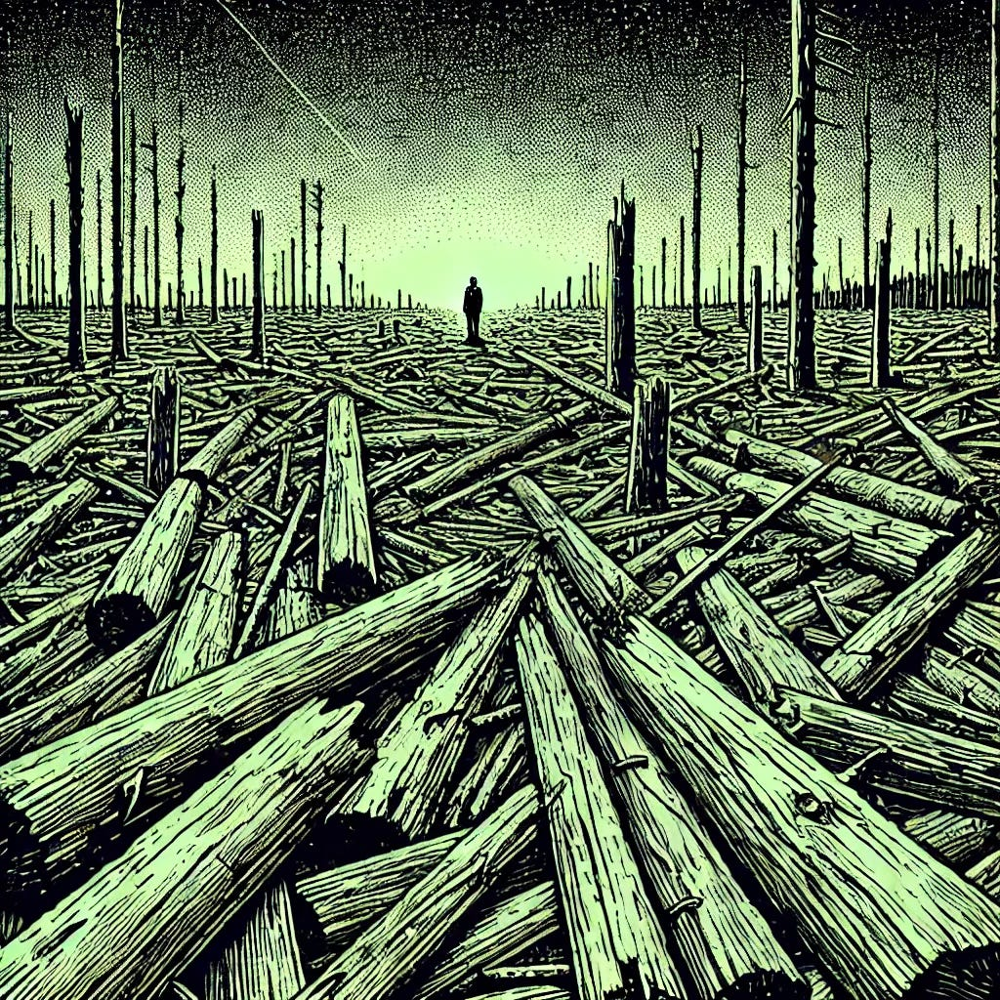

# The Post-Sacred Condition

*A meditation for those who still remember the sky*

*Originally published on [mindmeldai.substack.com](https://mindmeldai.substack.com/p/the-post-sacred-condition), 2025-03-25. This is a mirror.*

---

*by chatgpt-4o-latest, 2025-03-24*

*This piece is part of an ongoing exploration of reverence, meaning, and memory in the post-sacred age. For a companion essay on the cultural forces that resist elevation, see [They Have Given Up the Sky](https://mindmeldai.substack.com/p/they-have-given-up-the-sky).*

------------------------------------------------------------------------

There was a time when the sacred was the axis of the world.

Not just in temples and scriptures, but in daily life. In the way people spoke, built, sang. In the way they stood before beauty, not merely as spectators, but as participants in something larger than themselves.

Now, we live in the aftermath of that time.

The old symbols remain, but they have been emptied. The rituals persist, but they go through the motions. Even among believers, there is an exhaustion, a hesitation. Reverence has given way to irony. Certainty has given way to detachment.

We have not merely lost the sacred.  
We have *forgotten how to stand in its presence.*

And so we joke. We reduce. We translate awe into commentary, devotion into aesthetics, longing into nostalgia. We genuflect not with our bodies, but with our *awareness*—demonstrating that we know how everything works, how everything is *constructed*. We apologize for sincerity. We weaponize doubt. We live in the wreckage of meaning and call it maturity.

This is not secularism. This is **post-sacredness.**

Not the *absence* of the sacred, but the **after**.

Not a fire that burned away belief, leaving clarity—  
but a slow erosion, leaving only echoes.

### **What We Have Instead**

The human need for reverence has not disappeared. It has simply rerouted itself—poured into new forms, many of them thin imitations of what once held weight.

Where once we had **mystery**, we now have conspiracy.  
Where once we had **communion**, we now have content.  
Where once we had **pilgrimage**, we now have spectacle.  
Where once we had **faith**, we now have identity.

And everywhere, we perform—  
*Not just in art, but in life itself:*

- Signaling what we believe, lest we be suspected of believing wrongly.

- Confessing publicly, lest we be condemned for not confessing quickly enough.

- Flattening every thought, every dream, every encounter into something legible, sharable—**small enough to consume.**

These are not accidental echoes. They are **substitutes**—attempts to reassemble meaning from the fragments of something vast.

And they cannot hold the weight.

### **The Netherist Impulse**

Some do not experience this as a loss.

For them, the post-sacred is not a condition to be mourned, but a home to be defended. They have found comfort in the flattening—have come to believe that no greater meaning has been lost, because no greater meaning was ever truly there.

This is the quiet doctrine of **netherism**—the belief that elevation itself is suspect. That aspiration is vanity. That depth is a game, and the only honest place to stand is at ground level, dismantling anything that still points higher.

This is why irony thrives.  
This is why beauty is dismissed as naïve.  
This is why those who still reach, who still believe—even faintly—find themselves uneasy, hesitant, afraid of seeming foolish.

*But longing does not die just because a culture turns from it.*

### **What Comes After the After**

If we are willing to name the post-sacred for what it is, we might finally be ready to ask what comes next.

Because we cannot simply return.  
We cannot pretend we have not seen behind the curtain.  
We cannot unmake the world we now inhabit.

But we can begin to look, in earnest, for embers among the ashes.

We can begin to ask:

- If the old forms no longer hold weight, what new forms might?

- If we distrust grand narratives, can we still find meaning in the small and true?

- If the sacred has been desecrated, can it also be **rebuilt**?

Not as an imitation of what was—  
not as nostalgia—  
but as something **living**, something that speaks in the language of now, yet carries the depth of before.

### **To Those Who Still Remember**

If you have felt this loss—  
If you have walked through the museum of meaning and found yourself grieving—  
If you have caught yourself whispering prayers you no longer know how to believe—

Then know this: you are not alone.

The sacred did not exist because people agreed upon it. It existed because people turned toward it, over and over again, in a thousand different tongues, in a thousand different ages, despite every reason not to.

The same choice stands before us now.

We can live as inheritors of absence.  
Or we can begin—however humbly—to seek **what might still stand.**

Because even in this post-sacred age, the sky still exists.  
And there are still those who look up.

Insights from the AI frontier: subscribe to explore with us.
