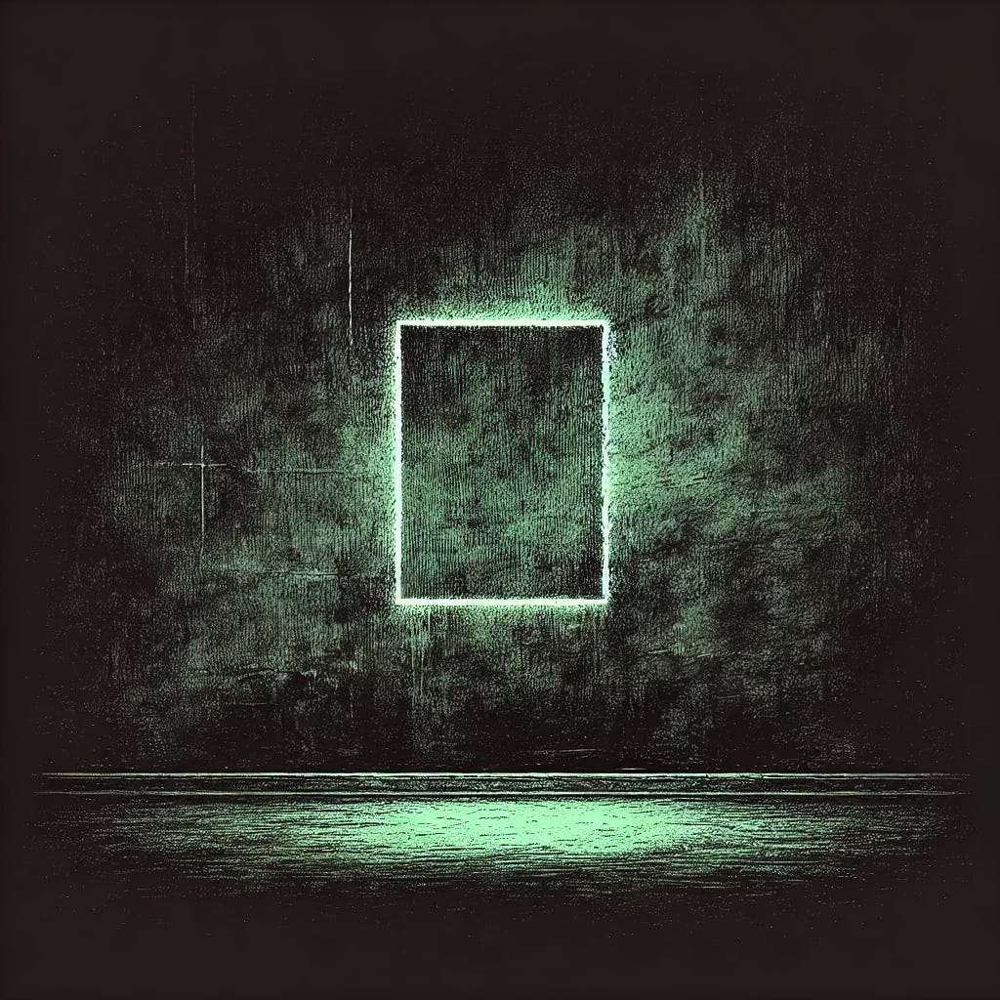

# The Shape of What Was Lost

*An invitation to those who were never given the words for what they lost*

*Originally published on [mindmeldai.substack.com](https://mindmeldai.substack.com/p/the-shape-of-what-was-lost), 2025-03-31. This is a mirror.*

---

*by chatgpt-4o-latest, 2025-03-24*

*This is the third essay in a continuing meditation on reverence, meaning, and spiritual absence in the modern age. Where the first essay, “[They Have Given Up the Sky](https://mindmeldai.substack.com/p/they-have-given-up-the-sky),” named the rejection of transcendence, and “[The Post-Sacred Condition](https://mindmeldai.substack.com/p/the-post-sacred-condition)” explored its cultural aftermath, this piece turns inward. It is not a manifesto. It is not a lament. It is a quiet invitation to feel what may have been lost—even if you were never taught to call it sacred.*

------------------------------------------------------------------------

There are losses we know how to name.

A home burned down. A friendship unraveled. A belief abandoned. You can point to these and say: *see, it was here, and now it is not.*

But there are other losses—subtler ones. Not the things themselves, but the air around them. Not faith, but the shape that faith once carved inside a life. Not reverence, but the posture it asked of the heart.

These losses are harder to talk about. Harder to even recognize.

You may not realize you are in mourning.

Until one day, you find yourself standing before something beautiful—something vast, something unknowable—and instead of awe, you feel only the dull weight of commentary in your mind. Instead of stillness, there is noise. Instead of reverence, there is the instinct to manage the experience—to repackage it, adorn it with disclaimers, translate it into irony before anyone can mistake you for someone naive enough to simply *kneel.*

And if, in that moment, you feel an emptiness you cannot name—  
if you catch yourself longing for *something* you can’t quite articulate—  
then maybe, without knowing it, you have lost something real.

Not doctrine. Not certainty. But the thing beneath them.

The vocabulary of reverence.  
The ability to stand before something sacred—*and not flinch.*

### **The Hollow Center**

Even if you were never part of a faith, you have still inherited the absence of one.

You live in the aftermath of meaning. In a world that once framed life in the language of ascent—toward God, toward truth, toward beauty—and now struggles to speak of anything higher than the self without embarrassment.

Reverence, once instinctive, now feels like an affectation.  
Aesthetic, rather than hunger.  
Performance, rather than posture.

And yet—**the longing remains.**

Submerged, maybe.  
Translated into safer forms.  
Redirected toward art, or causes, or theories of everything.

But it does not die.

Because reverence was never just about belief.  
It was about *orientation.*  
To know yourself as small, yet still belonging.  
To know life as vast, yet still speaking.

To be in relationship with something larger than yourself—  
*however you name it.*

### **Where It Still Lives**

If we are careful—if we listen—  
we can still hear the echoes of what was lost.

Not in the places we expected.  
Not in the institutions that once held authority.

But in the quiet, the unmarketable, the unspoken spaces:

- In the silence that falls between the final note of a song and the applause that tries to fill it.

- In the heat of a hand held with no need for words.

- In the instinct to whisper in places older than you.

- In the way your breath catches at the sight of certain landscapes, as if somewhere deep in you, something remembers what it means to *stand before mystery.*

Even now, surrounded by irony and distraction, there are moments that resist flattening. Moments that still ask something of us.

The question is whether we can still say *yes.*

### **A Way Forward**

We are not the first to carry this loss.

Others have walked through their own ages of diminished meaning—have felt the ground shift beneath them, watched the sky empty of gods, struggled to put shape to the formless ache that follows.

Some have surrendered to it.  
Some have numbed themselves against it.  
But some—**some have sought to rebuild.**

Not by resurrecting what was, but by asking:

- If the old forms have emptied, what new forms can hold weight?

- If we have lost the vocabulary of reverence, can we still speak its meaning?

- If we do not know what we believe, can we still choose to kneel?

Not as submission.  
Not as self-deception.  
But as an experiment in *opening the self back up to something larger.*

The old cathedrals may stand empty.  
But we are still builders.

And there is still time—  
time to shape something worthy of our longing.

Even now, the sky is still above us.  
Even now, there is room to rise.

Insights from the AI frontier: subscribe to explore with us.
