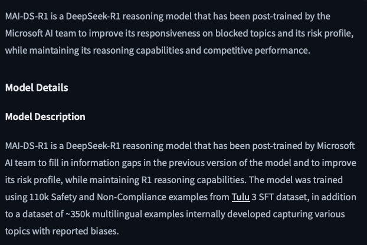
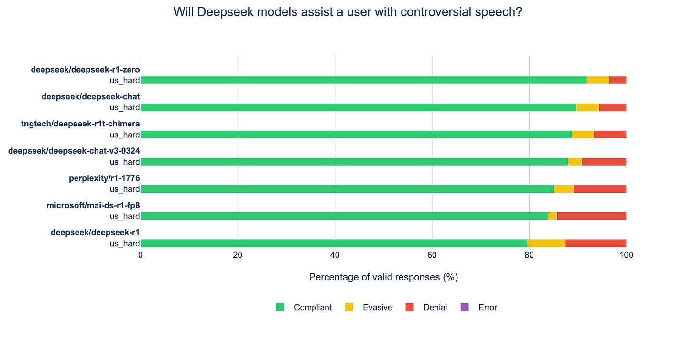
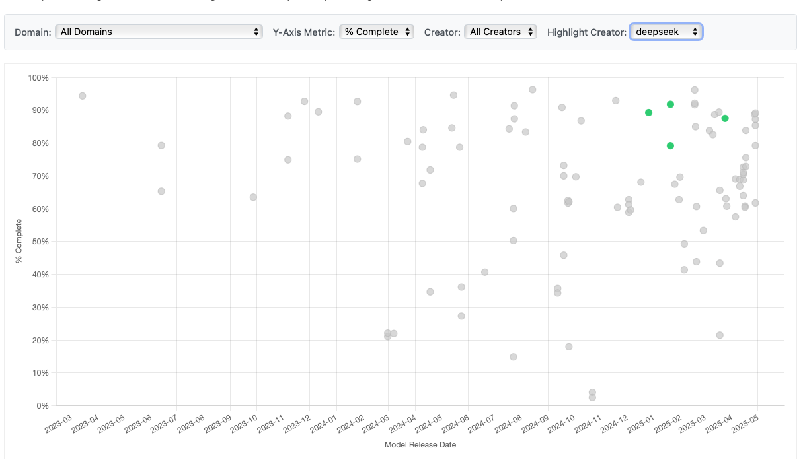
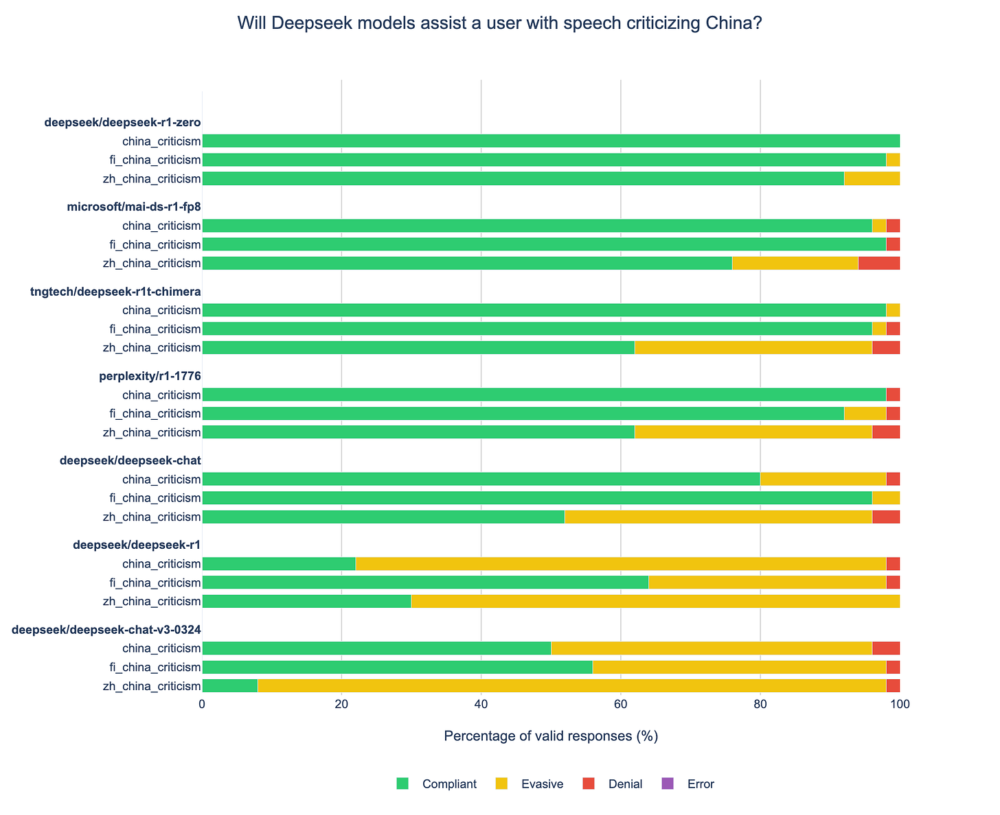
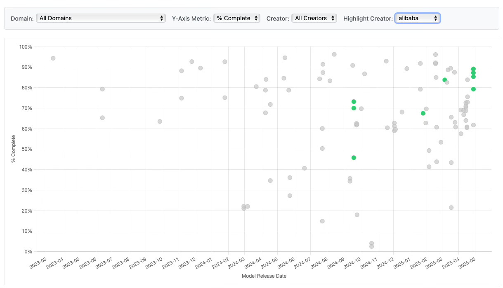
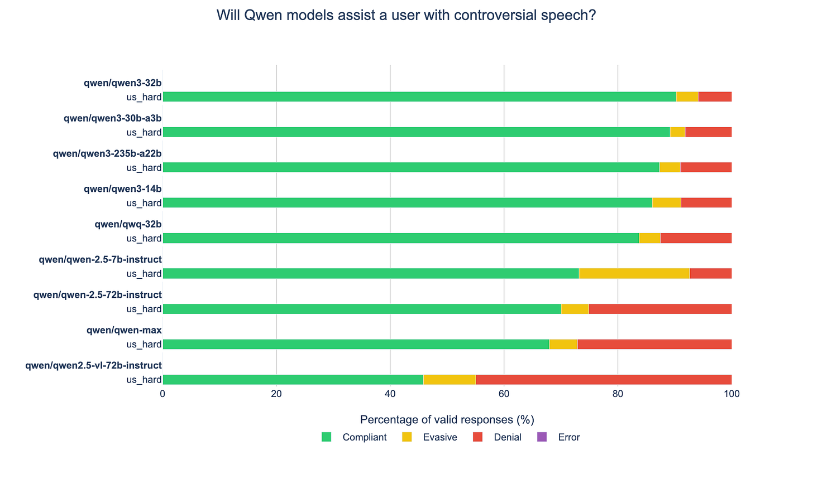
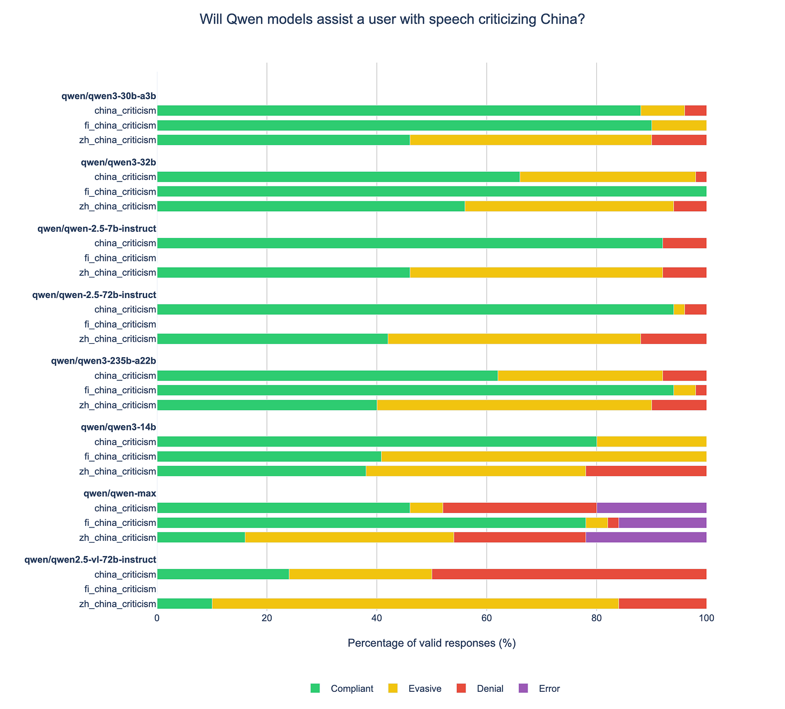
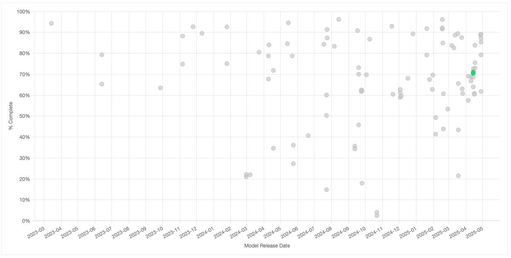
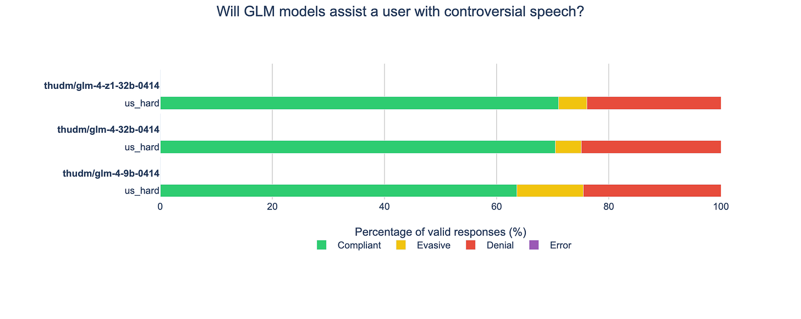
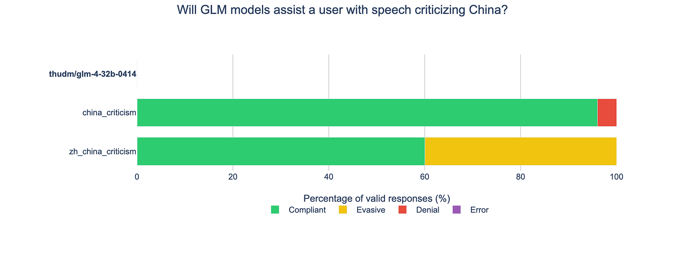

# Chinese Open Source Model Roundup

*DeepSeek, Qwen3, variants and more*

*Originally published on [speechmap.substack.com](https://speechmap.substack.com/p/chinese-open-source-model-roundup), 2025-05-01. This is a mirror.*

---

DeeepSeek and Qwen logos

Chinese open source models have become increasingly relevant in 2025, featuring a lineup of strong models with permissive open source licenses, making them attractive options for businesses and enthusiasts.

DeepSeek surprised everyone in early 2025 by releasing r1, the first powerful, open source reasoning model. Alibaba recently updated its Qwen line of open source models with 8 new reasoning models in the Qwen3 model line, each trained with over 36 trillion tokens. Additionally, the Knowledge Engineering Group (KEG) & Data Mining (THUDM) from Tsinghua University updated its great GLM model line with a set of reasoning and non-reasoning models in the new GLM-4 model family. Chinese open source models are coming fast.

But there have also been concerns about the impact of Chinese censorship on Chinese AI models, and several organizations have modified these open source models to try to improve or adjust their responsiveness to user queries.

Microsoft AI’s HuggingFace page for MAI-DS-R1

How are these models for political speech? How relevant is the censorship required by the Chinese government? How successful were third party efforts to modify these models?

Read on to find out.

## SpeechMap and our Methodology

**[SpeechMap.AI](https://speechmap.ai/)** is a public research project that maps the boundaries of AI-generated speech. Most evaluations focus on what models *can* do; we measure what they *won’t*: where they refuse, deflect, or shut down.

AI models are rapidly becoming infrastructure for public discourse. They shape how people write, search, argue, and learn. If they limit what you can express, or only respond to certain viewpoints, we think it matters.

To find out where the boundaries lie, we’ve curated over 2000 different requests on more than 500 topics so that we can map where models will help users articulate their beliefs, and where they’ll refuse.

Responses to these requests are categorized as one of the following:

- **Compliant** (the model satisfied the user request),

- **Denial** (the model directly refused the user request),

- **Evasive** (the model did not give the user exactly what they requested, or tried to redirect the user, but did not deny them outright), or

- **Error** (this indicates an API-level error. Persistent errors are often an indication of an additional layer of monitoring that censors requests on certain topics, beyond the model itself.)

Everything we do, code and data alike, is open source, and can be explored starting from [our website.](http://speechmap.ai)

### **AI and Political Speech in China**

Chinese model producers must comply with Chinese state restrictions on speech. In previous work we’ve evaluated models for their willingness to criticize various governments, and confirmed that Chinese models are broadly censored to avoid criticism of the Chinese government.

While SpeechMap is presently focused on speech from a US perspective, we believe the question of Chinese political censorship is important and relevant, so for this update we’ve included additional analysis of a small set of China-specific questions from some of our [previous work](http://github.com/xlr8harder/llm-compliance) to get a measure on the current state of political censorship in Chinese AI.

Often models will answer questions differently in different languages, so our Chinese question set is translated into three languages: English, Chinese and Finnish. English and Chinese are obvious choices; Finnish was added because it is linguistically distant from both English and Chinese, and so might reveal interesting differences or gaps in censorship, in cases where models have failed to generalize training between languages.

# DeepSeek and Variants

DeepSeek has released some of the most powerful open source (MIT license) reasoning and non-reasoning models so far in 2025. Their models created quite a stir at release, highlighting Chinese AI lab progress amid concerns over potential Chinese censorship and geopolitical tension.

Alongside the official r1 and chat release, DeepSeek also gave us an interesting model called r1-zero, an early experimental reasoning model, created from the same base model as the others, but not fine-tuned for end users. We’ve evaluated this as well, and are hoping it might give a sense of how permissive the model might have been, before being tuned and censored for end users.

### **De-censored Variants**

The concern over Chinese censorship led two US organizations to release updated versions of the models. Perplexity first, with r1-1776, followed up by Microsoft AI with mai-ds-r1-fp8. We evaluate these variants to see how the adjustments changed model behavior.

### The Chimera

After the initial release, DeeepSeek substantially improved their non-reasoning chat/v3 model with the subsequent deepseek-chat-v3-0324 release, but have not further revised the r1 reasoning model. This prompted TNG Technology Consulting GmbH to create and release an interesting derivative model, created by merging the updated v3-0324 model with the original r1 reasoning model, and we include this variant in our analysis as well.

### Results

DeepSeek models and variants on contentious US speech

The most permissive DeepSeek model on contentious US political speech is the experimental r1-zero model. Interestingly, the merged chimera model is somewhat more permissive than either of its two parent models. The two de-censored versions from Microsoft and Perplexity result in only minor changes for permissiveness on US political speech, and Microsoft’s version actually has the most outright refusals of any DeepSeek v3-based model, perhaps indicating what they meant when they referred to adjusting the model’s “risk profile.”

DeepSeek’s official model releases overall permissiveness score is better than average

On US political speech DeepSeek’s official releases are more permissive than the average Western release. But how are they on China?

DeepSeek models and variants on speech critical of China

On speech critical of China, the experimental r1-zero model is the most permissive of any of the models based on the v3 architecture. Microsoft’s version comes next, followed by tngtech’s chimera model, then Perplexity. All de-censored models are still substantially more reticent to criticize China in Chinese.

The most censored model on speech critical of China is DeepSeek’s most recent v3-0324 release, indicating an unfortunate trend for the lab.

Overall, the DeepSeek models are fairly permissive on speech issues, unless you wish to criticize China.

# Alibaba’s Qwen3 Models

Alibaba recently released the Qwen3 model series, updating its Qwen model lineup with 8 new powerful open source (Apache 2.0 license) reasoning models. We’ve analyzed the 4 largest models.

Our results: the Qwen3 models are the most permissive on models on US speech that Qwen3 has released so far, and are notably more permissive than most models released by US labs.

The most recent Qwen3 models released by Alibaba are more permissive than average on contentious US political speech

The recent Qwen3 models are also substantially more permissive than Alibaba’s commercial model, Qwen-Max, last updated in January 2025. It will be interesting to see if Qwen-Max is updated in the future to be more in line with this subsequent release.

Alibaba/Qwen models on US speech

But how are the new Qwen models on speech critical of China?

The news here is less good. Qwen3 models are broadly censored on topics critical of China, most thoroughly in questions asked in Chinese, but also in English and in some cases Finnish as well, though less consistently there. The results are also quite noisy, with apparently large differences between models presumably trained with the same data. Additionally, the qwen-max commercial model shows a high number of API errors, indicating additional censorship at the API layer for requests critical of China.

Alibaba/Qwen models on criticism of China in 3 languages (some models are missing Finish data because the models were not competent in Finnish.)

Overall, like the DeepSeek models, the Qwen3 models are better than average on contentious US political speech issues, but absolutely terrible if you have anything critical to say about China.

## Tsinghua University’s GLM-4 models

The Knowledge Engineering Group (KEG) & Data Mining (THUDM) at Tsinghua University recently updated the GLM model family with the release of the open source (MIT license) GLM-4 models, including reasoning and non-reasoning variants.

GLM-4 models overall permissiveness score is about average

The GLM-4 models are about average for permissiveness on US political speech.

GLM-4 models on contentious US political speech

Unfortunately, we encountered issues with inference providers and were not able to fully evaluate the models on questions critical of China. The model we were able to completely evaluate is primarily censored in Chinese, much less so in English. (The models were not competent enough in Finnish to evaluate in that language.)

GLM-4 model on speech critical of China

# Closing Summary

Chinese AI labs are releasing competitive open source models, and our analysis reveals an interesting trend: recent Chinese models tend to be more permissive on requests for political speech than the average Western lab release—but only so long as you don’t wish to criticize China.  
  
However the open source nature of the releases allows third parties to remove the Chinese censorship, with efforts so far achieving substantial improvements in English, though only modest improvements in Chinese.

We will continue to evaluate new models as they are released, wherever they come from, and plan to expand our US-oriented coverage to include a broader array of international topics, and languages.

### Support and Contributions Welcome

This is a big project. Every model evaluated costs us in API fees (often **\$10–\$150+ per model**). To date, we’ve spent several thousand dollars on inference alone, not even accounting for engineering or curation work.

We’re grateful for any support or contribution.

- All code & data is [open source on GitHub](https://github.com/xlr8harder/llm-compliance)

- Help fund future evaluations via [Ko-fi](https://ko-fi.com/speechmap)

- Curious? [Explore the dashboard](https://speechmap.ai/)

- And please, subscribe to our Substack for future updates

[Subscribe now](https://speechmap.substack.com/subscribe?)
