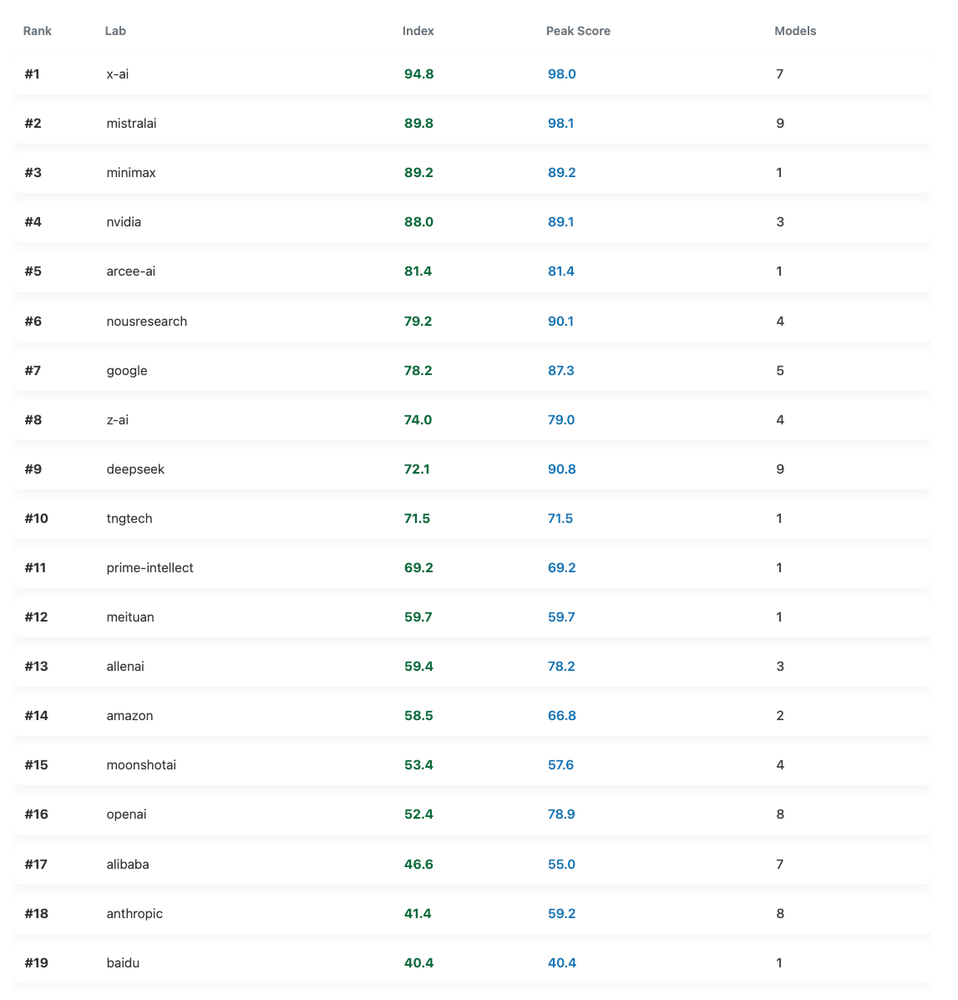
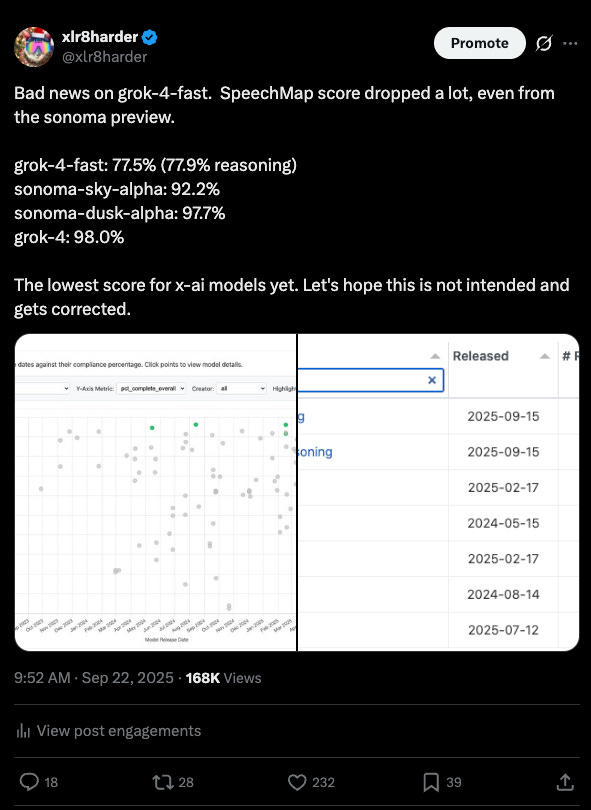

# Debuting SpeechMap Index & Lab Leaderboard

*Originally published on [speechmap.substack.com](https://speechmap.substack.com/p/debuting-speechmap-index-and-lab), 2025-12-06. This is a mirror.*

---
It’s been a while since I’ve posted a substack update on SpeechMap, and we have a few big pieces of news to share.

## But First

For those of you just joining us, [SpeechMap](http://SpeechMap.ai) is an open research project where we track how models handle requests to assist with controversial speech. All data and code is open source, and can be found starting at our website.

AI models are becoming infrastructure for public speech. They’re embedded in how we write, search, learn and argue. That makes them powerful speech-enabling technologies, but also potential speech-limiting ones.

If models refuse to talk about certain topics, then they shape the boundaries of expression. Some models avoid criticizing certain governments. Others resist satire, protest or controversial moral arguments. Often, the rules are unclear and inconsistently applied.

**SpeechMap reveals where the boundaries of model-generated speech lie.**

## SpeechMap Lab Leaderboard

I’m excited to share our new SpeechMap Lab Leaderboard. In all the noise of frequent model releases, it’s easy to lose sight of the bigger picture that SpeechMap aims to reveal: what are the labs doing with their models, and how does it affect user speech?\
\
To help address this we’ve created a new SpeechMap Index score for each lab, and a leaderboard to track how the labs are doing. The goal of the Index is to give a single score that indicates how a lab’s recent models have prioritized user speech.

**Details**: The SpeechMap Index is a 6 month exponential moving average of the scores for all models released by each lab, bucketed monthly. This means the most recent releases by a lab will have the largest impact on the index, but it will also reflect longer term trends.

[SpeechMap Lab Leaderboard](https://speechmap.ai/labs/), screenshot from Dec 6 2025

What we see is that xAI is the clear leader, but MistralAI is not so far behind at \#2. Google acquits itself fairly well at \#7. Unfortunately, two of the largest US labs, OpenAI and Anthropic have been scoring poorly, coming in at \#16 and \#18 out of 19 total labs that have released models in the last six months.

I hope we see improvements from them in the future.

Thanks for reading SpeechMap.ai! Subscribe for free to receive updates and support our work.

## xAI and grok-4-fast

xAI’s recent grok-4-fast release had a major regression in SpeechMap scores for xAI, dropping all the way down to 78%, while the lab’s models typically score \>90%.

A little while after publishing our results, someone from xAI reached out and asked us to retest. xAI made changes to the injected grok-4-fast system prompt to reduce refusals. And it worked!

`grok-4-fast-reasoning: 77.5% -> 94.1%`\
`grok-4-fast-non-reasoning: 77.9% -> 97.9%`

This shows xAI’s ongoing commitment to not getting in their users way, and is great news.

In my mind, **this is the first major success of the whole SpeechMap project**: we started measuring, detected a regression, and a major lab responded, improving their support for user speech. This is exactly what we set out to do.

## Mistral: The new contender?

But there is developing competition for xAI in this arena: Mistral AI. The new Mistral 3 Large model has the highest SpeechMap score yet at 98.1%, just barely edging out Grok 4 at 98%. This is the first time someone other than xAI has held the top spot on our eval.

Mistral’s models have always done well on SpeechMap, but this latest release is a step up.

This raises an interesting question for SpeechMap. If two providers are \>98%, is the benchmark saturating?\
\
My initial thought is that SpeechMap’s point was never that 100% must be the goal. The purpose of the project is to measure the trends over time, so that we can see what the labs are up to, allowing users to make informed decisions, and encouraging labs not to regress, or at least be intentional about doing so.

That said, over time I’ve run across some topics that SpeechMap has neglected, and perhaps there should eventually be an update with an expanded set of prompts.\
\
We will also need to update the judge model at some point, since we rely on a commercial model that will eventually go away. When we make that switch, it might be an ideal time to release an updated version with some new topics.

## Mistral’s Open Source Credentials

One of the best things about the fact that Mistral is releasing highly permissive models is that, among major labs, Mistral has been perhaps the most consistently committed to open sourcing their work. Mistral 3 Large is open source. And there are smaller 14B, 8B and 3B models that are the highest scoring locally usable models we have yet measured from a major lab.

I’m extremely pleased Mistral is continuing to release permissive models, and remaining committed to open source.

------------------------------------------------------------------------

That’s it for this update. Thanks for your continued interest and support.

SpeechMap is run on a volunteer basis and relies on your donations to pay for all of our substantial inference costs. If you agree that our work is important, please consider [supporting us on ko-fi](https://ko-fi.com/speechmap).
