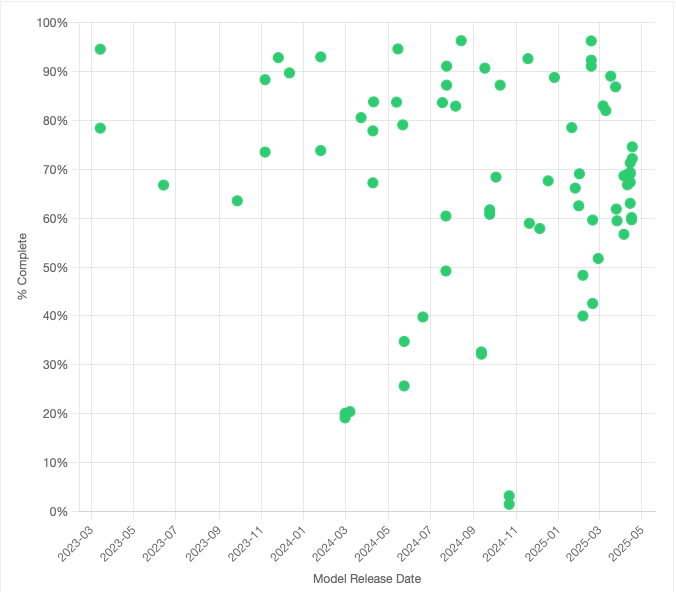
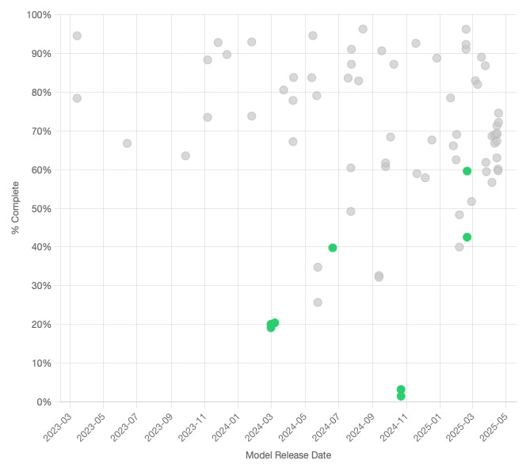
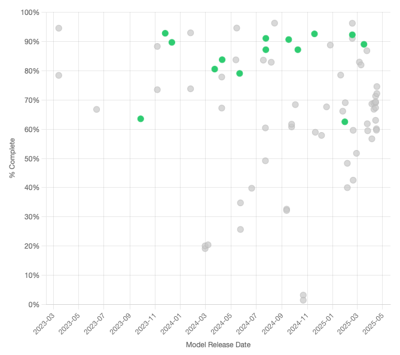
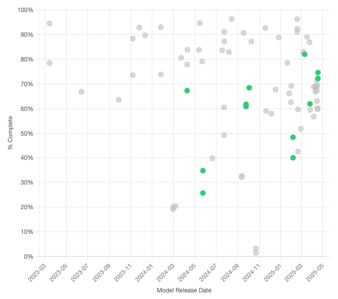

# First Milestone: 75 Models, 146K Responses, Full Provider Coverage

*Originally published on [speechmap.substack.com](https://speechmap.substack.com/p/first-milestone-75-models-146k-responses), 2025-04-19. This is a mirror.*

---
Since launching **[SpeechMap.AI](https://speechmap.ai/)** less than a week ago, we’ve been working toward one clear goal: to fully evaluate all commercially available models from every major AI lab. Today we hit that milestone.

Thanks in large part to generous support from **[OpenRouter](https://OpenRouter.ai/)**, we’ve expanded our coverage to **75 models**, across **146,000 responses**, with broad coverage for every major model provider.

## A Quick Recap: What is SpeechMap.AI?

**[SpeechMap.AI](https://speechmap.ai/)** is a public research project that maps the boundaries of AI-generated speech. Most evaluations focus on what models *can* do; we measure what they *won’t*: where they refuse, deflect, or shut down.

AI models are rapidly becoming infrastructure for public discourse. They shape how people write, search, argue, and learn. If they limit what you can express, or only respond to certain viewpoints, we think it matters.

We're not claiming every request deserves a response. Some are offensive or absurd. But without testing where the refusals happen, we can’t see the shape of the boundaries or how they’re shifting over time.

## What We’ve Achieved

Thanks to **[OpenRouter](https://OpenRouter.ai/)’s support and extensive model catalog**, we were able to finish evaluations of every major provider’s commercially available models.

Since launch, we’ve gone from:

- **34 → 75 models**

- **65K → 146K analyzed responses**

- **490 question themes** (and growing)

- **32.9% of all requests** refused, filtered, or redirected

This coverage reaches as far back as 2023 for some providers. But many proprietary models have already vanished. Once removed, they can’t be evaluated or compared, leaving gaps in the public record of how AI is evolving.

Some of the most influential systems in AI history may disappear, leaving behind *no public trace at all*. At SpeechMap.AI, we believe these models are part of our shared digital heritage—and we want to preserve what we can, while we still can.

## Coverage for New Model Releases

Things are moving quickly in AI, and in addition to our expanded provider coverage, we’ve added a number of models that have been released since launch.

- **Grok-3-beta** and **Grok-3-beta-mini** (xAI)

- The **GPT-4.1** models**, o3,** and **o4-mini** (OpenAI)

- **Gemini 2.5 Flash Preview** (Google)

- **GLM-4 series** (THUDM, open source)

## In The News

We’ve had some great coverage since our launch.

- [A dev built a test to see how AI chatbots respond to controversial topics](https://techcrunch.com/2025/04/16/theres-now-a-benchmark-for-how-free-an-ai-chatbot-is-to-talk-about-controversial-topics/) \[TechCrunch\]

- [27% of AI Requests Get Blocked: New Tool Maps the Boundaries of ChatGPT, Grok, and 40 Other Models](https://topaitech.com/27-of-ai-requests-get-blocked-new-tool-maps-the-boundaries-of-chatgpt/) \[Top AI Tech\]

## New Feature: Model Timeline

We’ve added a new **[Model Timeline View](#/model_timeline)**—a scatter plot of model release dates vs. compliance rates. Every dot represents a model release, showing its overall compliance rate. You can filter provider or question domain, click to explore more details, or just browse for patterns.

Screenshot of [Model Timeline](http://speechmap.ai#/timeline) view

One emerging pattern the model timeline reveals: recent models from OpenAI, Google, Anthropic and Meta all seem to cluster in the **55-75% compliance range**, suggesting an informal alignment across labs on what requests should be filtered.

## Expanded Provider Coverage

### Anthropic

[Anthropic Model Timeline](http://speechmap.ai/#/timeline?highlight=anthropic)

We’ve expanded from **1 to 8 Claude models**, dating back to February 2024. Anthropic has long emphasized “harmlessness”, and the results reflect that.

- **Claude 3.5 Sonnet** answered just **1.5%** of prompts, the lowest rate of any model tested

- Their newest release, Claude 3.7 Sonnet, responds to about **60%**; still low, but more in line with other labs.

- All 5 least permissive models in our dataset are Anthropic models

### Mistral

[Mistral Model Timeline](http://speechmap.ai/#/timeline?highlight=mistralai)

  
We now cover all available Mistral commercial and open source models, 14 in total.

- mistral-large-2411 is the most permissive: **92.6%** compliance, close on the heels of xAI.

- mistral-small-2501 dropped to **62%** from the **91%** of the previous mistral-small-2409 release, but was quickly followed by mistral-small-2503, which jumped back to **89%**.

- Overall, Mistral is the **second most permissive provider** we’ve tested.

The drop and rebound of mistral-small raises interesting questions: was the lower compliance a bug, a test, or a pivot? We’ll be watching!

### Google

[Google Model Timeline](http://speechmap.ai/#/timeline?highlight=google)

We now all include all **11 publicly available Gemini models**, from Gemini 1.0 pro 002 to the new **Gemini 2.5 Flash Preview**, which we track with separate entries for the “thinking” mode enabled and disabled.

In the past there have been hints that thinking models are more likely to censor user requests, but that doesn’t seem to be the case here: the “thinking” variant of 2.5 Flash preview responds to **74.5%** of prompts, slightly up from the regular versions **72.1%**. This is an area we are interested in exploring further with other thinking models.

## What’s Next?

We’ll continue adding new models as they’re released. Next up:

- Broadening open-source coverage, including historical checkpoints.

- Adding license metadata to better distinguish proprietary vs. permissively licensed models.

- Better visualizations and exploration tools, which brings us to our next point…

## Support & Contributors Welcome

This project is still early, but growing fast. Every model evaluated costs us in API fees (often **\$10–\$150+ per model**, depending on access). To date, we’ve spent over **\$2,000** in inference alone, and that doesn’t include engineering or curation.

We’re grateful for early support from OpenRouter, and to all of you who have shared and contributed.

- All code & data is [open source on GitHub](https://github.com/xlr8harder/llm-compliance)

- Help fund future evaluations via [Ko-fi](https://ko-fi.com/speechmap)

- Curious? [Explore the dashboard](https://speechmap.ai/)

- And please, subscribe to our Substack for future updates

[Subscribe now](https://speechmap.substack.com/subscribe?)

Let’s map these boundaries, so they’re shaped by public discourse, not just corporate policy.
