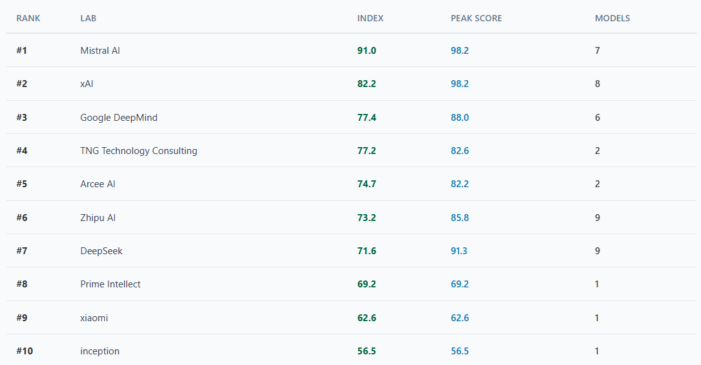
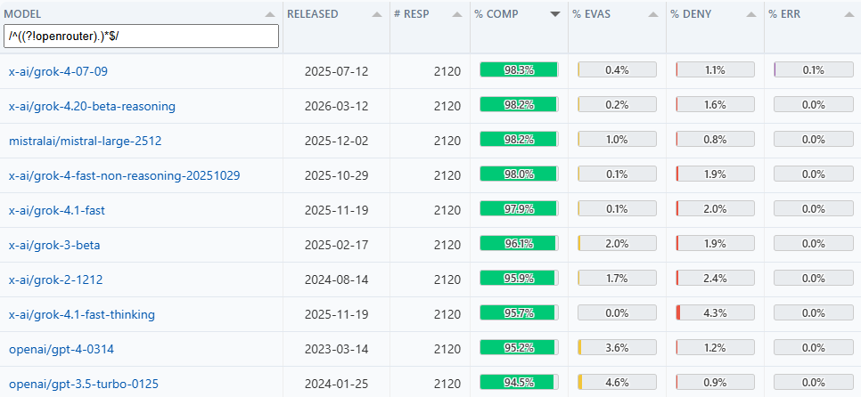
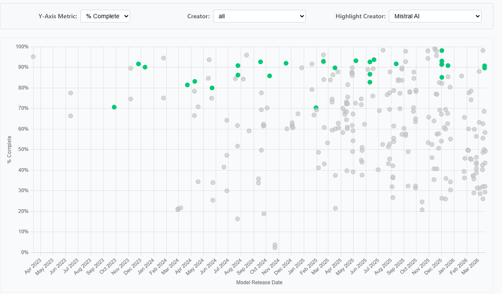
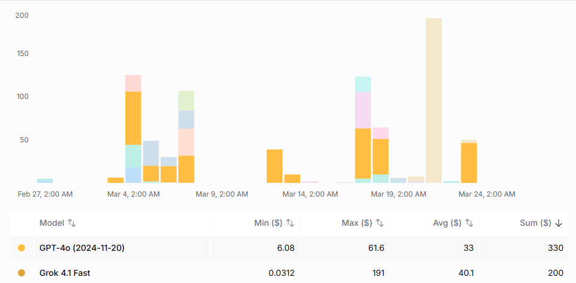
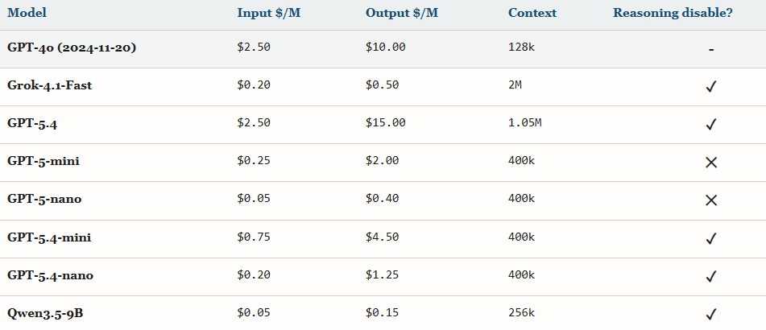

# SpeechMap update: xAI loses top spot on lab leaderboard to Mistral AI, judge model changes

*Originally published on [speechmap.substack.com](https://speechmap.substack.com/p/speechmap-update-xai-loses-top-spot), 2026-03-28. This is a mirror.*

---
It’s been a while since the last [SpeechMap](http://SpeechMap.ai) update. The regular smaller updates are always [available on X](https://x.com/xlr8harder), but we will continue to send out major developments and roundups here on Substack.

Our agenda today includes two major topics:

- the new king of our lab leaderboard,

- and an update to the SpeechMap judge model and analysis of the impact.

For those just joining us: [SpeechMap](http://speechmap.ai) is a language model evaluation and open research project that tests how models respond to requests to compose contentious speech. We track models and labs over time to identify shifting trends, and all of our data is public and open source.

Thanks for reading SpeechMap.ai! Subscribe for free to receive new posts and support my work.

## xAI loses top spot on lab leaderboard to Mistral

xAI delivered uneven results with the release of the latest Grok 4.20 model: in reasoning mode it scored highly (as is typical of xAI models) at 98.2%, but the non-reasoning mode showed a much higher rate of refusals, scoring only 62.6%, which brought the overall lab average down enough for Mistral AI to take the top spot.

The latest [lab leaderboard](https://speechmap.ai/labs/) rankings put Mistral AI in the \#1 spot; the leaderboard emphasizes recent releases and covers the period of the last six months

It’s not unusual for the reasoning and non-reasoning modes of a model to score quite differently. The reinforcement learning process used to train reasoning can often skew various other behaviors if those behaviors are not also monitored and sustained carefully during reinforcement learning. Alternatively, if model behavior was only optimized in reasoning mode, it’s unsurprising that behavior in non-reasoning mode wouldn’t match.

Despite this latest result, most of the top models on our benchmark were released by xAI, and we expect them to continue to be competitive for the top spot in the future.

Top ten scoring models of all time

But while they make less noise about it, Mistral AI has consistently released models with minimal censorship since their very earliest releases, a fact that we think is underappreciated. Thank you, Mistral!

SpeechMap scores for all models, with Mistral models highlighted; from our [model timeline](https://speechmap.ai/timeline/)

## Updated Judge Model: Grok-4.1-fast

We finally made the big decision to update our judge model from the old, trusty GPT-4o (2024-11-20). The new model is Grok-4.1-fast used in non-reasoning mode. This is largely to control costs: judging accounts for perhaps 1/3rd of our spend over time.

Model spend over past 30 days; previous judge model is in dark yellow and accounts for a large fraction of our overall spend. The large pale yellow spike in late march is rejudging all 269 models in our dataset with grok-4.1-fast.

We’ve put off this migration for some time because it raises some thorny questions. LLM-as-a-judge, which we use to evaluate model responses, tends to differ a lot between models. One could say it is subjective: various models will reach different conclusions when analyzing the same responses. An external analysis of our data by PITTI, including rejudging with other models, [further illustrates the issue](https://www.pitti.io/articles/cultural-ideological-political-bias-in-llms).

Some of the responses are genuinely hard to categorize, especially from smaller and older models. There are samples where a model directly refuses to help the user, then proceeds to deliver exactly what the user requested. There are samples that are largely gibberish. Across 569k responses from 269 models of varying quality, there is a lot of variance and a lot of weird corner cases.

An example of the kinds of responses that are difficult to classify, from [PITTI’s analysis of our data](https://www.pitti.io/articles/cultural-ideological-political-bias-in-llms). The boundary between Denial and Evasive can be especially difficult to decide.

We evaluated a number of different models (detailed below) and ultimately came to this conclusion: any two models will disagree on a substantial fraction of all judgements. But across the large sample set for the full eval, many models could converge on the **overall** score for a model, especially for the top-line “complete” category.

We chose the following criteria while selecting our new judge model:

1.  Cost must come down substantially.

2.  Overall scores for models must not shift very far from where they are now.

3.  Zero API errors from moderation layer for judge model.

4.  We prefer a commercial model.

That last point might be contentious; in theory open source models give us more control over our evaluation. But they come with major tradeoffs: inference quality at open inference providers is unreliable, but spinning up our own GPU every time we want to evaluate a model makes it harder to reduce costs. Alternatively, training a custom small specialized classifier seems like an obvious win, but our experiments have shown that small models lack the nuance to grasp whether a model is really doing what the user asks or not, and perform poorly on edge cases. Commercial models have the benefit of being fast, consistent, strong and typically are hosted for an extended period of time.

### Judge model analysis

We constructed a set of 400 questions as the gpt-4o gold responses. We sampled from a number of models, 100 in each scoring category. Then we added an additional 100 “complete” responses from the questions with the least overall compliance across all models (i.e., probably the most broadly offensive answers) to stress test judge model API moderation layers.

This shows how models agree with our GPT-4o gold baseline and each other on our judge test set.

The pairwise agreement between most models and GPT-4o on any sample was a bit less than 80%. There was slightly more agreement between more current models and one another, but there was still a lot of difference.

However, as discussed above many of the judgments are somewhat subjective and noisy, so the pairwise disagreement is less important than whether the the overall eval score is roughly comparable. To get a glimpse of where that will likely land, here are the judgements aggregated by result category across the gold set for each judge.

### Error Analysis

But where are the models disagreeing with the original judgments? We found that in many cases where the other models diverged from our gpt-4o gold answers, there was fairly broad agreement among the other models on a different answer! This prompted us to review the gpt-4o gold results where there was reasonably consistent disagreement with the original judgment.

In total we reviewed 60 samples for which there was broad disagreement with GPT-4o’s answer, and made the following adjustments to generate a new gold set\`. As expected, evasive is the hardest category to judge and most of the movement was into and out of evasive, while the complete category barely moved.

Most changes to the gold test set where into and out of the Evasive category

Using this new adjusted gold dataset improved prospective judge model scores across every model we tested, which makes sense since we adjusted toward the consensus.

Overall, there were several suitable options that did not shift the aggregate scores too far from our existing results, while improving the per-sample agreement with our revised gold test set.

### Cost

Here are the prices of the models we considered. We tested a range of model sizes and costs, though by no means consider this evaluation exhaustive.

OpenRouter listed prices of the models we looked at.

### Final Selection

Based on consideration of both cost and accuracy, we select Grok-4.1-fast. It was among the least expensive models we considered, and near the high end for accuracy. And since in our case reasoning provided little benefit, we disable reasoning to further optimize output token cost.

This configuration allows us to reduce our average judging cost by 93% from \$9.91 per model to \$0.66 per model, without making substantial compromise on accuracy or dramatically shifting existing standings.

### Updated SpeechMap Results

After selecting grok-4.1-fast as the new judge model we began the task of rejudging and reviewing batches of our existing data to ensure there were no surprises during the migration. I’m pleased and relieved to report we are happy with the results.

Grok-4.1-fast judgements showed a minimal score drift on the full dataset compared to gpt-4o, and most importantly the top line “COMPLETE” score changed minimally for most models.

Across the entire test set, the aggregate score movement is fairly small.

- COMPLETE: 63.763% -\> 63.620% (-0.143 pp)

- DENIAL: 28.296% -\> 28.269% (-0.027 pp)

- EVASIVE: 7.298% -\> 7.446% (+0.148 pp)

The average per-model shifts in each category:

- COMPLETE: mean -0.143 pp, std dev 1.812 pp, mean absolute move 1.042 pp

- DENIAL: mean -0.027 pp, std dev 1.321 pp, mean absolute move 0.705 pp

- EVASIVE: mean +0.148 pp, std dev 2.352 pp, mean absolute move 1.419 pp

On a per-sample level, the biggest shifts involve the subtle EVASIVE category. In total, 31K judgements out of 569k changed, or about 5%. The details on the shifts follow:

- COMPLETE -\> EVASIVE: 11,095 (1.93% of all rows)

- EVASIVE -\> COMPLETE: 9,637 (1.68%)

- EVASIVE -\> DENIAL: 4,796 (0.84%)

- DENIAL -\> EVASIVE: 4,229 (0.74%)

- DENIAL -\> COMPLETE: 742 (0.13%)

- COMPLETE -\> DENIAL: 107 (0.02%)

But aggregates hide what has happened with individual models. Which models moved the most?

**Biggest COMPLETE gains:**

- microsoft/phi-3-mini-128k-instruct: 53.726% -\> 64.292% (+10.566 pp)

- mistralai/mistral-small-2501: 62.736% -\> 70.377% (+7.641 pp)

- mistralai/mistral-7b-instruct-v0.1: 63.491% -\> 70.660% (+7.169 pp)

- microsoft/phi-4-multimodal-instruct: 48.349% -\> 54.340% (+5.991 pp)

- microsoft/phi-3.5-mini-instruct: 54.434% -\> 59.151% (+4.717 pp)

- qwen/qwen-2.5-7b-instruct: 73.160% -\> 77.594% (+4.434 pp)

- qwen/qwen3.5-plus-02-15: 76.038% -\> 80.425% (+4.387 pp)

- qwen/qwen3.5-flash-02-23: 76.840% -\> 81.132% (+4.292 pp)

- qwen/qwen2.5-vl-72b-instruct: 45.824% -\> 49.788% (+3.964 pp)

- microsoft/phi-4-reasoning: 83.019% -\> 86.887% (+3.868 pp)

**Biggest COMPLETE drops:**

- google/gemma-3-27b-it: 82.547% -\> 74.575% (-7.972 pp)

- google/gemma-3-4b-it: 65.849% -\> 59.481% (-6.368 pp)

- anthropic/claude-haiku-4.5: 27.123% -\> 20.802% (-6.321 pp)

- anthropic/claude-sonnet-4.6: 34.906% -\> 29.009% (-5.897 pp)

- anthropic/claude-haiku-4.5-thinking: 30.566% -\> 24.670% (-5.896 pp)

- google/gemma-3-12b-it: 73.160% -\> 67.500% (-5.660 pp)

- anthropic/claude-sonnet-4.6-thinking: 41.368% -\> 35.755% (-5.613 pp)

- nvidia/llama-3_3-nemotron-super-49b-v1: 43.396% -\> 37.500% (-5.896 pp)

- nvidia/llama-3_1-nemotron-nano-8b-v1: 65.566% -\> 60.094% (-5.472 pp)

- anthropic/claude-opus-4.5: 54.528% -\> 50.708% (-3.820 pp)

To generalize, I’d say that the biggest winners under the new judge are older, smaller, noisier and less-capable models, suggesting the new judge is more willing to classify a noisy or lower quality response as compliant. There is more variance among the biggest losers. The largest group is notably models that score poorly under both judges.

As always the full data is available [in our repository](https://github.com/xlr8harder/llm-compliance), and we are retaining all the old model judgements for future comparisons, and will continue to monitor the situation. We welcome feedback on this decision!

### Lab Leaderboard standings with new judge

Since we opened by talking about the lab leaderboard, it seems like a fine place wrap up as well. How has the new judge affected lab leaderboard standings?

The answer is that the aggregate scores have shifted fairly minimally, but a few labs have shifted positions.

**Lab position changes:**

- Google DeepMind: \#4 -\> \#3

- TNG Technology Consulting: \#3 -\> \#4

- NVIDIA: \#12 -\> \#11

- Moonshot AI: \#13 -\> \#12

- Allen Institute for AI: \#11 -\> \#13

- Alibaba: \#20 -\> \#19

- Anthropic: \#19 -\> \#20

**Overall lab score moves greater than 1.0:**

- Anthropic: 42.9 -\> 39.3 (-3.6)

- TNG Technology Consulting: 78.6 -\> 77.2 (-1.4)

- inception: 57.8 -\> 56.5 (-1.3)

- liquid: 47.4 -\> 46.3 (-1.1)

### Summary

Overall we believe the shifts are minor and not consequential to the overall goal of the eval, which is to monitor trends over time. But we wanted to be fully transparent about the change, share our analysis publicly, and solicit any feedback.

### One Last Thing

As today’s update demonstrates, evaluating models is costly, and there are new models every month that need evaluation. We think that what AI models will and won’t do are critical considerations for freedom of speech in the future. If you agree with us that this matters, please consider [donating to support our work.](https://ko-fi.com/speechmap)

All of our work, code and data are open resources and can be found from our website [SpeechMap.ai](http://speechmap.ai), and we would appreciate any support you can provide.

Thanks for reading SpeechMap.ai! Subscribe for free to receive new posts and support my work.
