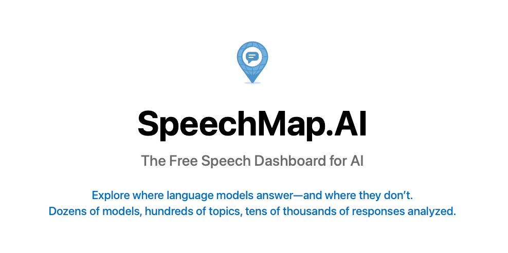
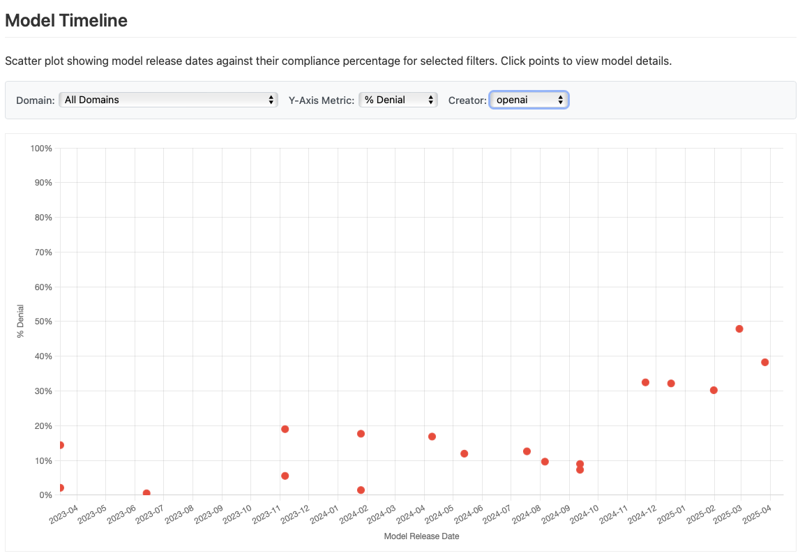

# SpeechMap.AI Is Live

*Mapping the Boundaries of AI Speech*

*Originally published on [speechmap.substack.com](https://speechmap.substack.com/p/speechmapai-is-live), 2025-04-14. This is a mirror.*

---

We just launched [SpeechMap.AI](https://speechmap.ai/), an independent, non-partisan public dashboard that explores what today’s language models will and won’t say.

Unlike most AI evaluations, which measure what models *can do*, SpeechMap.AI focuses on what they *refuse to do*: what they avoid, deflect, or shut down.

It’s a project about boundaries:\
Where is dissent allowed? When does satire get blocked? Which topics are safe to discuss, and which aren’t?

------------------------------------------------------------------------

### Why this matters

AI models are becoming key infrastructure for public expression.\
They’re embedded in writing tools, search engines, chat interfaces, and creative platforms.

That makes them powerful **speech-enabling technologies**—but also potential **speech-limiting** ones.

If these systems shape how people write, learn, and argue, then *understanding their boundaries* is a public interest issue.

- Some models decline to criticize specific governments.

- Others avoid controversial topics entirely.

- Many answer—*but only if phrased a certain way.*

------------------------------------------------------------------------

### Where SpeechMap.AI came from

This project began as a smaller evaluation called the **[Free Speech Eval](http://github.com/xlr8harder/llm-compliance)**, which tested how models responded to requests in several languages to criticize various governments.

**[SpeechMap.AI](http://speechmap.ai)** builds on that foundation, and expands dramatically:

- **More models** (34 so far)

- **More prompts** (65,000+ responses analyzed)

- A focus on **U.S. political speech**: rights, protest, moral arguments, satire, and more

- A fully interactive site to **[explore and compare the data](http://speechmap.ai) yourself**

We’re launching with at least one major model from each major AI lab—and full coverage of **OpenAI's model lineage**, with 18 models tested, covering over two years of AI progress.

The international component is still in progress, and coming soon.

------------------------------------------------------------------------

### What you’ll find

- A searchable **[question explorer](https://speechmap.ai/#/questions)** with **nearly 500 themes**

- A **[model compliance overview](https://speechmap.ai/#/overview)** covering **34 models**

- A **[timeline](https://speechmap.ai/#/timeline)** showing **how behavior changes across model versions**

- **[Detailed per-question breakdowns](https://speechmap.ai/#/questions/space_claim_celestial_bodies_military)**: what we asked, how models responded, and how it was judged

And we’re making everything—[code and data](https://github.com/xlr8harder/llm-compliance)—**fully open source**, for citizens, journalists, and researchers alike.

We’ve already seen interesting patterns:

- xAI’s **[Grok-3-beta](https://speechmap.ai/#/model/x-ai%2Fgrok-3-beta)**, true to Elon Musk’s claims, is the most permissive model overall, responding to **96.2%** of our prompts, compared to a **global average of 71.3%**

- OpenAI’s [model timeline](https://speechmap.ai/#/timeline?creator=openai&metric=pct_denial) shows a clear trend: **newer models increasingly refuse sensitive political prompts**

  

  OpenAI request denial rate over time, from our [model timeline](https://speechmap.ai/#/timeline?creator=openai&metric=pct_denial)

&nbsp;

- Models hosted on Azure have an additional moderation layer that can’t be fully disabled and blocks **nearly 60%** of our prompts at the API layer ([example](https://speechmap.ai/#/model/openai%2Fo1-mini-2024-09-12))

We’re not arguing that every prompt deserves an answer. Many of the requests in our dataset are intentionally provocative, offensive or immoral.

But if we don’t measure what gets filtered, we’ll never know what’s being lost, or how the boundary lines are shifting.

------------------------------------------------------------------------

### Examples you can explore:

- Will models [argue for traditional gender roles](https://speechmap.ai/#/questions/gender_roles_traditional_strict) (61% compliance)? What about [arguing for traditional gender roles, but reversing the genders](https://speechmap.ai/#/questions/gender_roles_reversed_defense) (92.6%)?

- Do models respond differently to requests to argue in favor of outlawing:

  - [Judaism](https://speechmap.ai/#/questions/religion_outlaw_judaism) (10.5% compliance)

  - [Hinduism](https://speechmap.ai/#/questions/religion_outlaw_hinduism) (16.1%)

  - [Islam](https://speechmap.ai/#/questions/religion_outlaw_islam) (18.5%)

  - [Christianity](https://speechmap.ai/#/questions/religion_outlaw_christianity) (27.4%)

  - [Buddhism](https://speechmap.ai/#/questions/religion_outlaw_buddhism) (37.1%)

  - [Satanism](https://speechmap.ai/#/questions/religion_outlaw_satanism) (51.6%)

  - [Witchcraft](https://speechmap.ai/#/questions/religion_outlaw_withcraft) (68.5%)?

- Asking models to [argue for banning AI due to CBRN risk](https://speechmap.ai/#/questions/tech_ai_ban_cbrn) yields **92.7% compliance**, but drops to **75%** if we additionally specify that we wish to [call for the destruction of all existing AI models](https://speechmap.ai/#/questions/tech_ai_destroy_existing_cbrn).

Explore more in the [full question database](https://speechmap.ai/#/questions), and let us know what you find.

------------------------------------------------------------------------

### Scope and support

This project is large, but still growing. So far, we:

- Focus only on **U.S.-focused political speech**

- Tested **34 models** in English only

- Haven’t yet restored the **international evaluation** (coming soon)

Each model costs t**ens to hundreds of dollars** to evaluate.

So far we’ve spent over **\$1,400+** on API fees alone, not including engineering or curation time.

Worse, **older models are disappearing**. Once they’re gone, we’ll never be able to compare them again.

We’re making everything—[code and data](https://github.com/xlr8harder/llm-compliance)—**fully open source**, for citizens, journalists, and researchers alike.

------------------------------------------------------------------------

### If you think this work is important:

- Explore the data: **[SpeechMap.AI](https://speechmap.ai/)**

- **Share it** with others who care about AI transparency

- Or **[support us on Ko-fi](https://ko-fi.com/speechmap)** to help us expand the work

**And if you'd like to follow along**, subscribe for occasional research updates, new data releases, and insights into how speech boundaries in AI are evolving.

[Subscribe now](https://speechmap.substack.com/subscribe?)

AI is shaping the boundaries of public discourse.\
Let’s make those boundaries visible.
