# Vibe Coding in March 2023

*From the archive: early vibe coding experiments*

*Originally published on [xlr8harder.substack.com](https://xlr8harder.substack.com/p/vibe-coding-in-march-2023), 2025-08-31. This is a mirror.*

---
I discovered a post from my old, deleted Substack about early “vibe coding” with GPT-4 (which I called Prompt Driven Development at the time), published less than a week after GPT-4 was released. When GPT-4 came out, it was quite obvious that we had something fundamentally different on our hands.

The post is a demonstration of a little tool I created called git2gpt, which uses GPT-4 to mutate a git repository based on prompts provided by the user.

git2gpt was itself also written entirely by GPT-4, by copying and pasting from the Web UI until the tool was functional enough to connect directly to the OpenAI API and self-modify, so that I could continue adding all the features I wanted. It was a fun challenge at the time to do this without writing any code myself.

I know I wasn’t the only one doing this kind of experiment with GPT-4. But I am, perhaps, one of the few to document in detail what the state of the art looked like, so I’m republishing the post for curiosity and historical purposes. And, of course, so that I can proudly claim that I was vibe coding before Karpathy made it cool by coining the phrase in February 2025.

The original post follows from here, and was originally published March 19, 2023, just 5 days after the release of GPT-4. We have come a very long way.

Thanks for reading Unoptimized! Subscribe for free to receive new posts and support my work.

This is a demo of Prompt Driven Development with git2gpt. I won’t be developing and testing a full application here, my goal instead is to demonstrate a prompt-driven development workflow looks like.

We start with an empty repo.

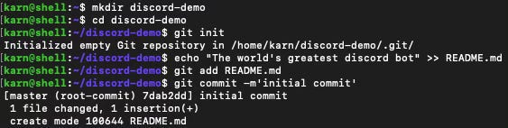

Begin with a prompt: ***Add a python discord bot that uses the OpenAI chat API to respond to messages***

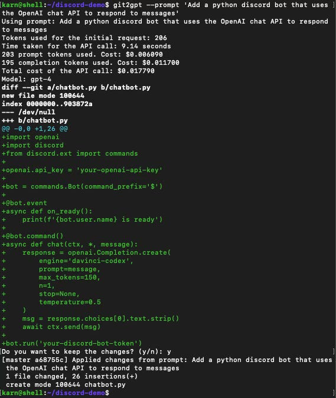

Not perfect, but that looks like a workable start. If I wanted to tweak the result, I can answer “n” and edit the files before committing them, but this looks fine to iterate from.

I don’t want to hardcode secrets, so let’s move those to the environment. Next prompt: ***load the discord bot token and the openai api key from the environment, instead***

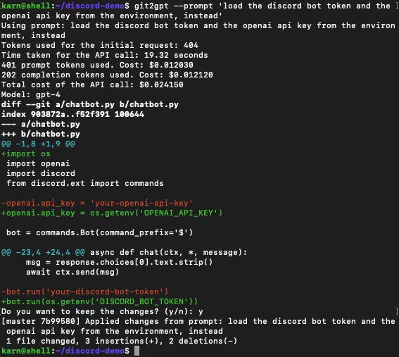

That’s not bad, but we need to provide some context. Next prompt: ***Store history for the last ten messages in each channel. use that history to generate the prompt for the OpenAI api call***

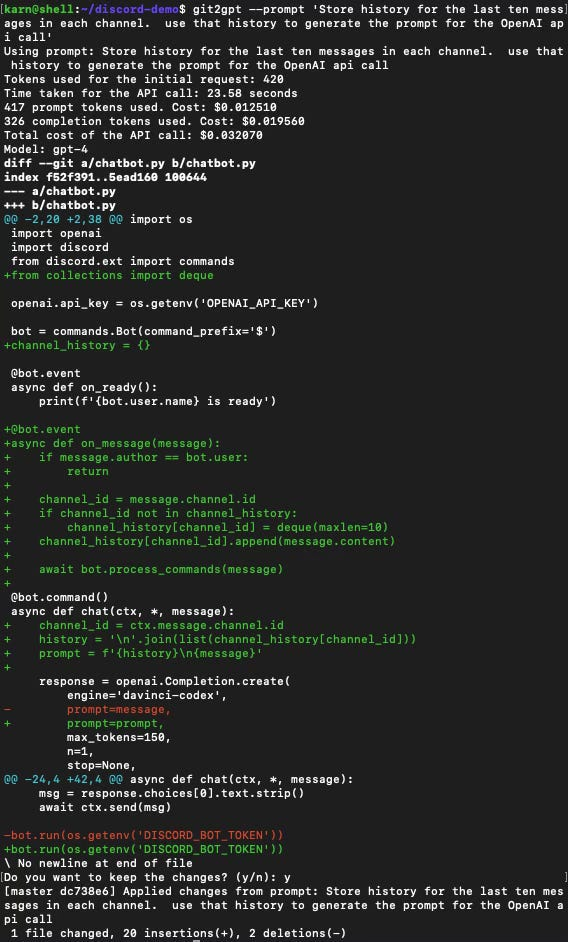

Cool that it actually used a deque. This is a start, but we’re not tracking speaker in the history, nor are we saving the bots own output to history.

Next prompt: ***channel_history should track the name of each speaker, and the history in the prompt should be formatted like a chat log. The bot's output should also be saved to the history.***

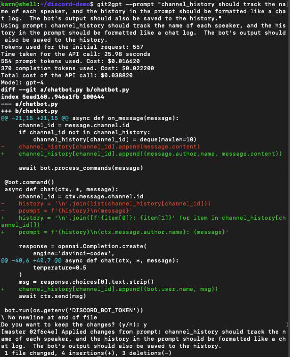

**Interlude**: does the code actually run? I set up a quick virtualenv to test, and no, it gets an immediate TypeError.

I’m not very familiar with the discord python library, so let’s just use the —editor flag to git2gpt in order to specify a more complicated multi-line prompt including the traceback. Prompt: ***The commands.Bot call is returning a TypeError. Please correct this:***

***Traceback (most recent call last):***

***File "/home/karn/discord-demo/chatbot.py", line 9, in \<module\>***

***bot = commands.Bot(command_prefix='\$')***

***TypeError: BotBase.\_\_init\_\_() missing 1 required keyword-only argument: 'intents'***

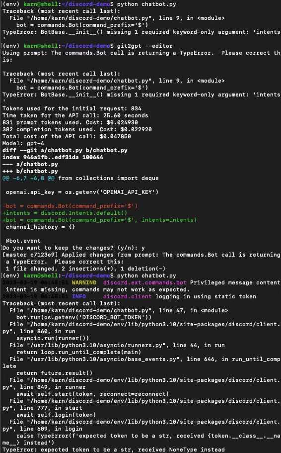

Sure, why not! That at least got us to the point where we’re failing to connect because I haven’t setup an API token for the bot. I’m not going to bother with that for this demo. Let’s iterate on the design a little more.

I want the users to be able to specify the mood the bot should use when responding. Figuring out how to specify this in a prompt was really challenging, and it didn’t go very well the first time. Prompt: ***If users prefix their message with a !\<mood\> tag, the prompt generated for OpenAI should indicate that the bot needs to respond with that kind of mood.***

***So for example, if the user said: "!scared Hello, bot!" the generated prompt would include special text indicating that the bot should respond to the message as if very scared.***

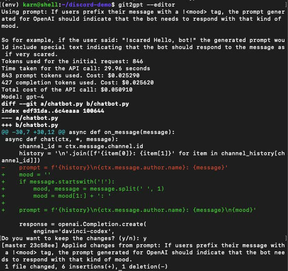

Not great, but, I think this is enough to iterate from. GPT-4 writes code pretty easily, but it’s a lot harder to get it to write code that writes prompts that work. Let’s try to improve this.

Prompt: ***The prompt needs to be changed so that the specified mood is used to generate the bot's reply.***

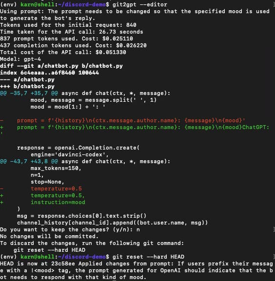

Nope. This is the first output I’m throwing away. Let’s get more explicit.

Prompt: ***The prompt should include explicit instruction to generate the next response from the bot as if it is feeling the specified mood. The default mood should be neutral.***

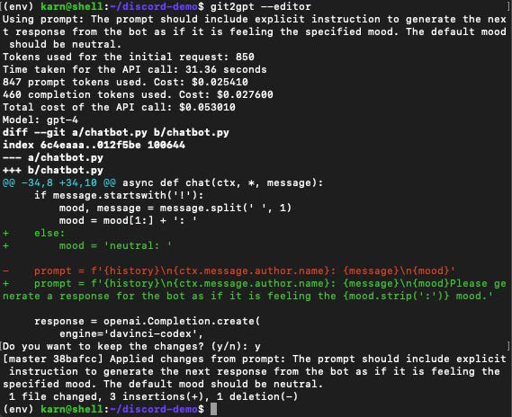

This is a lot closer to something useful, but the prompt still isn’t formatted in a way that is likely to get good results. Using prompts to generate well-designed prompts is really awkward, and I’m just going to consider this good enough for the purposes of this demo.

Let’s add some features. Prompt: ***The mood-specific prompts should be stored in their own dictionary, with an entry for each mood. Start with a few basic ones.***

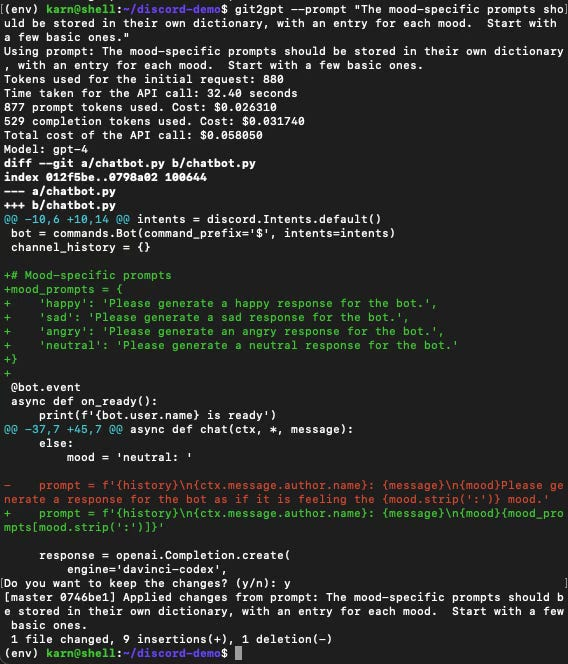

That went a little better. Now, I want users to be able to specify their own mood prompts to get the kind of response they want from the bot.

Prompt: ***Add a command for the bot for users to be able to create a new mood prompt by specifying a name and the prompt text.***

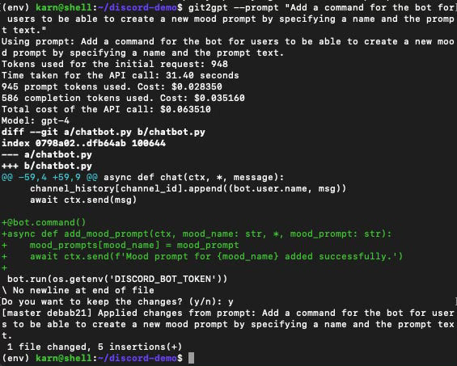

Halfway there. Prompt: ***Whenever a new mood prompt is created, save all of the mood prompts to a file. Load the full set of mood prompts when the bot starts.***

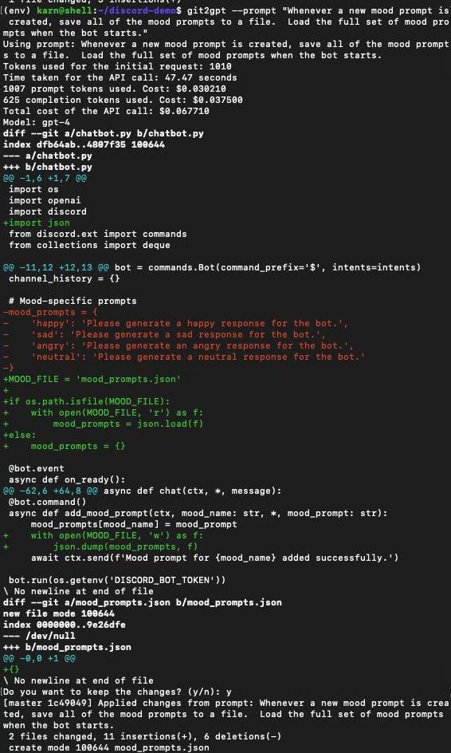

Rickety, but it probably works. Let’s fix a few bugs.

Prompt: ***Fix the race condition bug in writing the prompts file.***

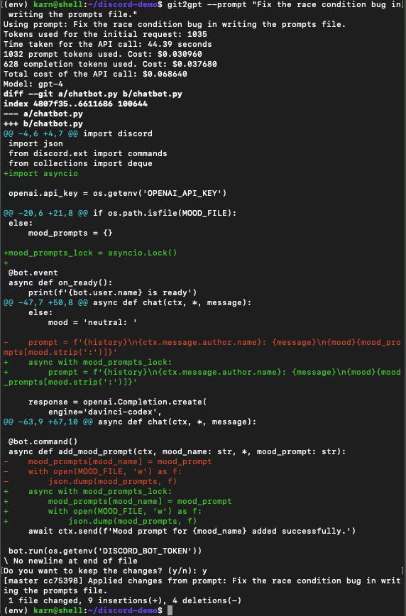

This looks plausible. Next prompt: ***Provide a reasonable default response if a user specifies a mood that is undefined.***

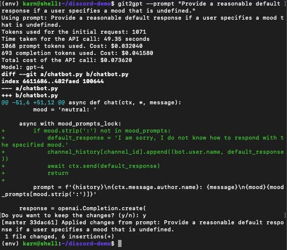

Now, we need some basic defaults! Prompt: ***Add some default moods to the mood file: happy, sad, and alexjones***

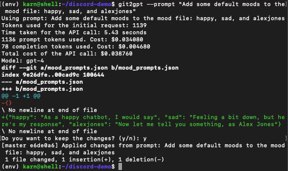

# **Results**

Prompt Driven Development is fun to experiment with, but feels like a powerful workflow whose time has not yet come. Sometimes the results are amazing, but often it’s more difficult to figure out how to specify the changes than to simply write the code yourself.

In many ways using git2gpt feels like overseeing an extremely junior developer who knows basic language features, but has little experience making good software architecture decisions.

Here are a few major takeaways:

**You still really want a developer:** I not only had to know what to ask for, but also be able to evaluate the results and identify bugs.

**Speed:** GPT-4 feels very slow when used this way. I’ve waited upwards of 3 minutes for responses for simple changes to a code base that is about 5k tokens in size.

**Context window limitations:** Limited context window size presents a real challenge for any but the most modestly-sized repository. Using git2gpt to make changes to the git2gpt repository is very nearly maxing out the 8k context window. Larger context windows will help here (there is a GPT-4 with a 32k context window, but I don’t know if anyone has access to it yet) but there is also a lot that can be done on the client side to filter and only send the most pertinent parts of the code.

**It will only get better from here:** This workflow feels primitive but powerful, and at the rate progress comes with AI, I would anticipate rapid improvement in capability in this area.

*git2gpt is available at ~~https://github.com/karnagraha/git2gpt~~, or can be installed using pip.*

Thanks for reading mindmeld! Subscribe for free to receive new posts and support my work.

Thanks for reading Unoptimized! Subscribe for free to receive new posts and support my work.
