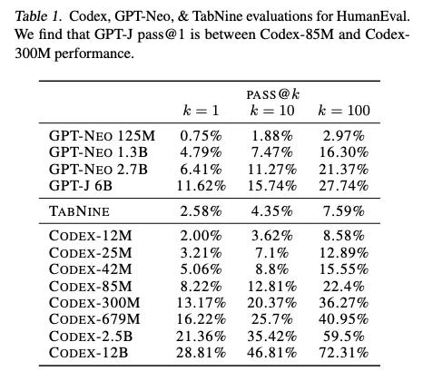
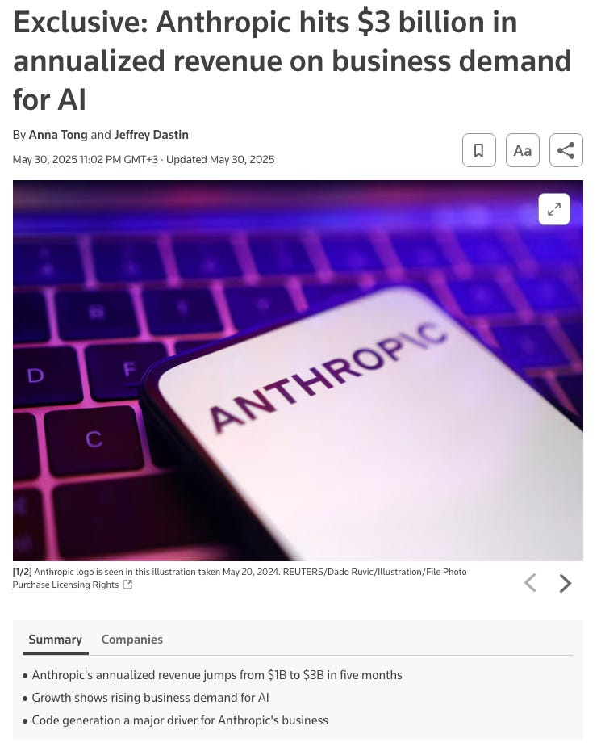
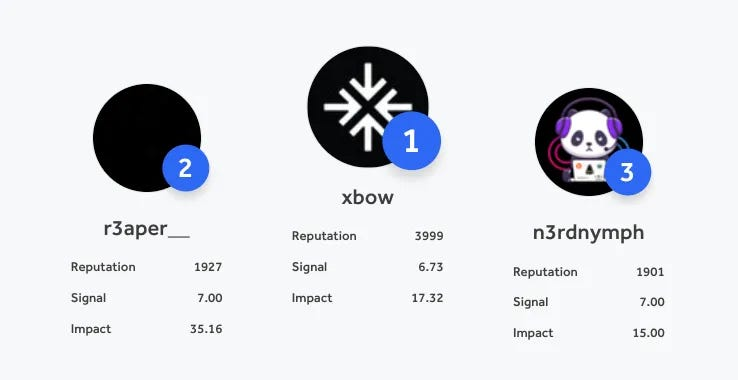

# Which AI Agents Succeed and Why

*Originally published on [xlr8harder.substack.com](https://xlr8harder.substack.com/p/which-ai-agents-succeed-and-why), 2025-07-07. This is a mirror.*

---
AI Agents are here, and they’re not quite what most people expected.

Unlike basic chat assistants, agents are systems that iteratively plan, act repeatedly and self-critique toward achieving a goal. Many people are disappointed because some results haven’t matched the hype, but at the same time we’re seeing enormous growth in coding agents, and there are early results showing up in fields like cybersecurity and pharmaceutical research where AI agents are creating real value.  
  
These results fly in the face of the common perception of today’s AI models as unreliable confabulation machines. How are people using these unreliable tools and achieving good results? Are there problem domains in which agents are good, and others in which they are bad? What differentiates them?  
  
It’s actually pretty simple, but it’s worth spelling out.

## Test Time Scaling

First some background. It’s commonly understood in AI research that as you give AI models more chances at developing a solution, there is an increasing chance that at least one solution is right. This is at least partially because AI models are stochastic: they incorporate randomness in creating their result, via the sampler.

This means that when you give a model a problem to solve, it will always generate answer-shaped output, but it won’t always be a good answer, and when the problem is at the very limit of a model’s capabilities the answer will be wrong quite often. But like a human getting ten chances to make a single challenging basketball shot, if you give the model more chances to generate a solution, there’s an increasing chance at least one of them will be correct.

In AI research this is often represented with the **pass@k** metric, which indicates how many of the problems get at least one correct answer when a model is given **k** chances to answer each problem. Intuitively, the more chances a model gets at generating a solution, the more likely it is that at least one of the solutions will be correct. And results bear this out:

From [Evaluating Large Language Models Trained on Code (Chen at al, 2021)](https://arxiv.org/abs/2107.03374): when you give models more chances at generating a solution, there is an increasing chance that at least one of the solutions is good. The pass@k figure indicates the rate that at least one result out of k attempts is correct.

When a problem is trivial for a model, there is still a small chance it will get it wrong. And even if a problem is extremely hard for a model, there is a chance it will give a valid solution.  
  
So now you’ve got one good answer mixed in with 99 bad ones. What are you supposed to do with that?

## Cheap Verification is the Key

The way people create value with AI agents today has a lot in common with search, and that’s one way to think about today’s agents: search assistants.

When you submit a search request to Google, you get back a list of results, and only some of them will be relevant to the task at hand. You need to have a method to discern the good results from the bad ones. It’s the same with today’s AI models.

Specifically, today’s AI models can create great value as agents in domains where:

- the agent can narrow a large field of potential solutions to a small number of higher probability candidates;

- error cost is low: solutions can be reality tested effectively to reduce false positives, or the cost of failure is low;

- and the value of a successful result is higher than the cost it takes to validate it.

That is, a promising domain for agents is one in which the ratio of the value of success to the cost of error checking is high. We can call this the **Expected Value Ratio** and express it like this:

**EVR = (Expected Value of a Result) / (Verification Cost)**

Eventually we may be able to blindly trust the quality of results that AI models return, but today that is often not the case. If we wish to build useful agents, we should look for low hanging fruit in domains where we can treat agents like search, winnowing down a vast field of possibilities into a few higher probability options that are then relatively cheap to verify compared to the value of a successful result.

## Today’s Agents

There are domains where agents are already yielding great results. Let’s look at them through this framework.

### Software

Code either works or it doesn’t. Tests pass or they don’t. We can always try again if a solution is bad, because the cost of each attempt is low.

Most successful coding agent workflows incorporate something like **Test Driven Development (TDD).** TDD is a development methodology where before you write the software, you first create the tests that the software must pass. Then, when creating the software, you know you aren’t finished until all the tests pass. This is a great fit for agents.

Let’s consider our evaluation framework:

- The agents reduce a vast field of all possible code to plausible candidate solutions.

- Error cost is low: software failures are typically cheap, and while bugs can be subtle, verification of results is possible with the correct software development methodologies.

- Return on success is high: both at an individual level (the right piece of software can be worth quite a lot of money) and via scale (assisting developers with their jobs worldwide.) The AI coding market is [projected to reach nearly \$26 billion by 2030](https://www.globenewswire.com/news-release/2025/03/26/3049705/28124/en/Artificial-Intelligence-Code-Tools-Research-Report-2025-Global-Market-to-Surpass-25-Billion-by-2030-Demand-for-Low-Code-No-Code-Platforms-Spurs-Adoption.html).

This is an obvious good fit, and it’s clear why coding agents are enjoying early success.

Anthropic recently reported [rapid growth](https://www.reuters.com/business/anthropic-hits-3-billion-annualized-revenue-business-demand-ai-2025-05-30/), due in large part to its coding agents.

### Cybersecurity

Early cybersecurity agents are showing promising results as well, especially on the offensive (penetration testing) side. In offensive cybersecurity, a business’s website and other internet connected services are evaluated in a “black box” fashion by a penetration tester, looking for vulnerabilities and ways to break into a system. The idea is that a penetration tester works exactly the same as a hacker does, with the same information available and the same access to potential attack surfaces.

Offensive pen-testing fits the framework quite well, and recently, the XBOW cybersecurity startup announced their autonomous AI agent has reached the top ranking on the HackerOne cybersecurity leaderboard.

XBOW [recently announced](https://xbow.com/blog/top-1-how-xbow-did-it/) their autonomous AI agent reached number one on HackerOne.

Let’s look at this with our framework again:

- Attack surfaces can be huge, there are many candidate approaches to consider, many APIs to evaluate, and so on. Reducing a large field of potential approaches to a small set of options would be very helpful here.

- Error cost is low: it’s still just software. If an attack fails, you can just try another one. And success tends to be clear: an attack succeeds, or it doesn’t.

- Return on success is high: [global pen-testing market is currently valued at \$2.45 billion and is expected to reach \$5.25 billion by 2032.](https://www.fortunebusinessinsights.com/penetration-testing-market-108434)

This looks like a great fit: cheap verification, large opportunity.

### Pharmaceutical Research

The pharmaceutical industry is showing early but promising results with research agents. In June 2025, Nature Medicine published *[A generative AI-discovered TNIK inhibitor for idiopathic pulmonary fibrosis: a randomized phase 2a trial.](https://www.nature.com/articles/s41591-025-03743-2)* [from Xu Z., Ren F., Wang P. et al.](https://www.nature.com/articles/s41591-025-03743-2) This paper is the first peer-reviewed report of a fully de-novo small-molecule (rentosertib) discovered by a generative chemistry pipeline that has already cleared Phase 2a safety/efficacy trials. This is a novel compound and the first drug to target TNIK, with a substantially reduced target-to-lead timeline from traditional approaches.

This is just one of several impressive AI agent results in pharmaceutical research. And our evaluation framework confirms this should be a fruitful area for agents:

- Enormous field of diseases, possible pharmaceutical compounds, and potential drug targets.

- Reality testing is possible, first filtering via cheaper *in silico* testing, and then through more expensive wet lab work and clinical trials. Though this whole process eventually gets quite expensive, this is offset by:

- Enormous potential return on investment: a single new blockbuster drug can be worth billions or even tens of billions.

So despite the somewhat expensive validation process, the enormous potential returns still suggest pharmaceutical research is a good target for AI agents.

### Self-driving Cars?

Let’s consider a field where AI is also showing early success but seems like a weird fit with our framework: driverless cars.

- Candidate space is quite small once systems mature. There are only so many things you can do with a car.

- The error cost is extremely high (car accidents and fatalities!) Risk can be mitigated with human oversight (which also creates a useful reality testing signal—did the human safety driver need to take control?) but this is both expensive and time consuming.

- But the TAM is vast: [the autonomous-vehicle market is estimated to be worth \$274 billion in 2025, with a compound annual growth rate of 36.3% to reach \$4.45T by 2034.](https://www.precedenceresearch.com/autonomous-vehicle-market)

Our evaluation framework suggests this is a questionable choice for AI agents. Despite that, people are doing it anyway, and achieving early success. Does this mean the framework is wrong?

I don’t think it does. The point of the framework is to identify *low hanging fruit*, places where agents are high leverage using the technology we have available today. Autonomous driving doesn’t fit: estimates are that [the industry has already invested \$160B over nearly a decade](https://www.theverge.com/24065447/self-driving-car-autonomous-tesla-gm-baidu) to develop self-driving cars, and we’re still not quite there.  
  
While the winners here will get access to an enormous market, the incredible expense and risk involved suggests this is something other than low hanging fruit.

## Conclusion

Agents are here, but they’re not yet suitable to every task. Before you consider building or using an agent, you should evaluate the opportunity with the framework I laid out above:

- Does the problem area have a very large search space of potential solutions that AI models can substantially reduce and are at least some proposed solutions good?

- Is it possible to test solutions cheaply to determine if a solution is good?

- Is the value of a correct solution worth more than what it costs to test a potentially large number of failures?

If you can say yes to all three then you have a perfect candidate for AI agents.

Assuming this framework holds, what does it suggest about the future?

1.  Obviously, **there is a lot of value in smarter models**. Not much needs to be said here as this thesis is already driving tens of billions of dollar of investments in frontier AI labs. But as it applies specifically to our framework: smarter models mean better candidates and access to a larger variety of problem domains.

2.  **Solution verification techniques are a key leverage point.** Finding ways to take advantage of existing methods to verify solutions, or developing new, scalable techniques is a critical requirement for developing good, competitive AI agents. (And further, though I don’t discuss it here, verification is also an important input into developing smarter models. Solution verification can be used to generate known-good training data and to provide reward signals for reinforcement learning.)

3.  **As models improve, the EVR threshold will shift**. Problems that are marginally viable today will become obvious wins, and entirely new categories of problems will become tractable.

Despite the fact that it’s still hard to develop a good agent and there will be some spectacular failures, **we will see a lot of successful agent startups that unlock a lot of value.** Don’t believe the hype that every problem is about to fall to AI agents, but don’t believe the permanent skeptics either, or you’ll be left behind.

Thanks for reading Unoptimized! Subscribe for free to receive new posts and support my work.
